## Table of Contents
[Acknowledgements](#acknowledgements)  
[1. Conventions](#1-conventions)  
[2. Setting up, getting started](#2-setting-up-getting-started)  
[3. Design](#3-design)  
&nbsp;&nbsp;[3.1. Architecture](#31-architecture)  
&nbsp;&nbsp;[3.2. UI component](#32-ui-component)  
&nbsp;&nbsp;[3.3. Logic component](#33-logic-component)  
&nbsp;&nbsp;[3.4. Model component](#34-model-component)  
&nbsp;&nbsp;[3.5. Storage component](#35-storage-component)  
&nbsp;&nbsp;[3.6. Common classes](#36-common-classes)  
[4. Implementation](#4-implementation)  
&nbsp;&nbsp;[4.1. Undo and redo feature](#41-undo-and-redo-feature)  
&nbsp;&nbsp;&nbsp;&nbsp;[4.1.1. Design considerations](#411-design-considerations)  
&nbsp;&nbsp;[4.2. Find feature](#42-find-feature)  
&nbsp;&nbsp;&nbsp;&nbsp;[4.2.1. Design considerations](#421-design-considerations)  
&nbsp;&nbsp;[4.3. Memo and ContactedDate person attributes](#43-memo-and-contacteddate-person-attributes)  
&nbsp;&nbsp;&nbsp;&nbsp;[4.3.1. Design considerations](#431-design-considerations)  
&nbsp;&nbsp;[4.4. Duplicate detection](#44-duplicate-detection)  
&nbsp;&nbsp;&nbsp;&nbsp;[4.4.1. Design considerations](#441-design-considerations)  
&nbsp;&nbsp;[4.5. Previous and next feature](#45-previous-and-next-feature)  
&nbsp;&nbsp;[4.6. Detailed Person Display](#46-detailed-person-display)  
&nbsp;&nbsp;&nbsp;&nbsp;[4.6.1. Design considerations](#461-design-considerations)  
&nbsp;&nbsp;[4.7. Backup Feature](#47-backup-feature)  
&nbsp;&nbsp;&nbsp;&nbsp;[4.7.1. Design considerations](#471-design-considerations)  
[5. Documentation, logging, testing, configuration, dev-ops](#5-documentation-logging-testing-configuration-dev-ops)  
[6. Appendix: Requirements](#6-appendix-requirements)  
&nbsp;&nbsp;[6.1. Product scope](#61-product-scope)  
&nbsp;&nbsp;[6.2. User stories](#62-user-stories)  
&nbsp;&nbsp;[6.3. Use cases](#63-use-cases)  
&nbsp;&nbsp;[6.4. Non-Functional Requirements](#64-non-functional-requirements)  
&nbsp;&nbsp;[6.5. Glossary](#65-glossary)  
[7. Appendix: Instructions for manual testing](#7-appendix-instructions-for-manual-testing)  
&nbsp;&nbsp;[7.1. Launch and shutdown](#71-launch-and-shutdown)  
&nbsp;&nbsp;[7.2. Adding a contact](#72-adding-a-contact)  
&nbsp;&nbsp;[7.3. Editing a contact](#73-editing-a-contact)  
&nbsp;&nbsp;[7.4. Adding tags to a contact](#74-adding-tags-to-a-contact)  
&nbsp;&nbsp;[7.5. Deleting tags of a contact](#75-deleting-tags-of-a-contact)  
&nbsp;&nbsp;[7.6. Deleting a contact](#76-deleting-a-contact)  
&nbsp;&nbsp;[7.7. Finding contacts by their attributes](#77-finding-contacts-by-their-attributes)  
&nbsp;&nbsp;[7.8. Saving data](#78-saving-data)  

--------------------------------------------------------------------------------------------------------------------

## Acknowledgements

* https://se-education.org/addressbook-level3/DeveloperGuide.html#proposed-undoredo-feature

--------------------------------------------------------------------------------------------------------------------

## 1. Conventions
When this document is read, certain words or sentences are represented in different fonts, typefaces, sizes and weights. This highlighting is systematic where different words will be represented in the same style to indicate their inclusion in a specific category. Below is a table that shows what those categories are and how they are represented by each format/symbol.

Symbol | What it means |
-----|----------------|
`add` | Words with this format are commands that can cause a response in Abπ or java class/variable names.
*Italics* | Sentences that are in italics represent additional information.
:bulb: | Extra tip that may be useful to the reader.
:information_source: | Important information to take note.
[here](#1-conventions) |Words that are in this format are clickable links that directs you to a certain webpage.

---

## 2. Setting up, getting started

Refer to the guide [_Setting up and getting started_](SettingUp.md).

--------------------------------------------------------------------------------------------------------------------

## 3. Design

:bulb: **Tip:** The ".puml" files used to create diagrams in this document can be found in the [diagrams](https://github.com/AY2122S2-CS2103T-T17-4/tp/tree/master/docs/diagrams/) folder. _Refer to the [PlantUML Tutorial at se-edu/guides](https://se-education.org/guides/tutorials/plantUml.html) to learn how to create and edit diagrams._

### 3.1. Architecture

The ***Architecture Diagram*** given above explains the high-level design of the App.

Given below is a quick overview of main components and how they interact with each other.

**Main components of the architecture**

**`Main`** has two classes called [`Main`](https://github.com/AY2122S2-CS2103T-T17-4/tp/tree/master/src/main/java/seedu/address/Main.java) and [`MainApp`](https://github.com/AY2122S2-CS2103T-T17-4/tp/tree/master/src/main/java/seedu/address/MainApp.java). It is responsible for,
* At app launch: Initializes the components in the correct sequence, and connects them up with each other.
* At shut down: Shuts down the components and invokes cleanup methods where necessary.

[**`Commons`**](#common-classes) represents a collection of classes used by multiple other components.

The rest of the App consists of four components.

* [**`UI`**](#ui-component): The UI of the App.
* [**`Logic`**](#logic-component): The command executor.
* [**`Model`**](#model-component): Holds the data of the App in memory.
* [**`Storage`**](#storage-component): Reads data from, and writes data to, the hard disk.

**How the architecture components interact with each other**

The *Sequence Diagram* below shows how the components interact with each other for the scenario where the user issues the command `delete 1`.

Each of the four main components (also shown in the diagram above),

* defines its API in an interface with the same name as the Component.
* implements its functionality using a concrete `{Component Name}Manager` class (which follows the corresponding API interface mentioned in the previous point.

For example, the `Logic` component defines its API in the `Logic.java` interface and implements its functionality using the `LogicManager.java` class which follows the `Logic` interface. Other components interact with a given component through its interface rather than the concrete class (reason: to prevent outside component's being coupled to the implementation of a component), as illustrated in the (partial) class diagram below.

The sections below give more details of each component.

### 3.2. UI component

The **API** of this component is specified in [`Ui.java`](https://github.com/AY2122S2-CS2103T-T17-4/tp/tree/master/src/main/java/seedu/address/ui/Ui.java)

The UI consists of a `MainWindow` that is made up of parts e.g.`CommandBox`, `ResultDisplay`, `PersonListPanel`, `StatusBarFooter` etc. All these, including the `MainWindow`, inherit from the abstract `UiPart` class which captures the commonalities between classes that represent parts of the visible GUI.

The `UI` component uses the JavaFx UI framework. The layout of these UI parts are defined in matching `.fxml` files that are in the `src/main/resources/view` folder. For example, the layout of the [`MainWindow`](https://github.com/AY2122S2-CS2103T-T17-4/tp/tree/master/src/main/java/seedu/address/ui/MainWindow.java) is specified in [`MainWindow.fxml`](https://github.com/AY2122S2-CS2103T-T17-4/tp/tree/master/src/main/resources/view/MainWindow.fxml)

The `UI` component,

* executes user commands using the `Logic` component.
* listens for changes to `Model` data so that the UI can be updated with the modified data.
* keeps a reference to the `Logic` component, because the `UI` relies on the `Logic` to execute commands.
* depends on some classes in the `Model` component, as it displays `Person` object residing in the `Model`.

### 3.3. Logic component

**API** : [`Logic.java`](https://github.com/AY2122S2-CS2103T-T17-4/tp/tree/master/src/main/java/seedu/address/logic/Logic.java)

Here's a (partial) class diagram of the `Logic` component:

How the `Logic` component works:
1. When `Logic` is called upon to execute a command, it uses the `AddressBookParser` class to parse the user command.
1. This results in a `Command` object (more precisely, an object of one of its subclasses e.g., `AddCommand`) which is executed by the `LogicManager`.
1. The command can communicate with the `Model` when it is executed (e.g. to add a person).
1. The result of the command execution is encapsulated as a `CommandResult` object which is returned back from `Logic`.

The Sequence Diagram below illustrates the interactions within the `Logic` component for the `execute("delete 1")` API call.

:information_source: **Note:** The lifeline for `DeleteCommandParser` should end at the destroy marker (X) but due to a limitation of PlantUML, the lifeline reaches the end of diagram.

Here are the other classes in `Logic` (omitted from the class diagram above) that are used for parsing a user command:

How the parsing works:
* When called upon to parse a user command, the `AddressBookParser` class creates an `XYZCommandParser` (`XYZ` is a placeholder for the specific command name e.g., `AddCommandParser`) which uses the other classes shown above to parse the user command and create a `XYZCommand` object (e.g., `AddCommand`) which the `AddressBookParser` returns back as a `Command` object.
* All `XYZCommandParser` classes (e.g., `AddCommandParser`, `DeleteCommandParser`, ...) inherit from the `Parser` interface so that they can be treated similarly where possible e.g, during testing.

### 3.4. Model component
**API** : [`Model.java`](https://github.com/AY2122S2-CS2103T-T17-4/tp/tree/master/src/main/java/seedu/address/model/Model.java)

The `Model` component,

* stores the address book data i.e., all `Person` objects (which are contained in a `UniquePersonList` object).
* stores the currently 'selected' `Person` objects (e.g., results of a search query) as a separate filtered list which is exposed to outsiders as an unmodifiable `ObservableList<Person>` that can be 'observed' e.g. the UI can be bound to this list so that the UI automatically updates when the data in the list change.
* stores a `UserPref` object that represents the user’s preferences. This is exposed to the outside as a `ReadOnlyUserPref` objects.
* does not depend on any of the other three components (as the `Model` represents data entities of the domain, they should make sense on their own without depending on other components)

:information_source: **Note:** An alternative (arguably, a more OOP) model is given below. It has a `Tag` list in the `AddressBook`, which `Person` references. This allows `AddressBook` to only require one `Tag` object per unique tag, instead of each `Person` needing their own `Tag` objects. 

### 3.5. Storage component

**API** : [`Storage.java`](https://github.com/AY2122S2-CS2103T-T17-4/tp/tree/master/src/main/java/seedu/address/storage/Storage.java)

The `Storage` component,
* can save both address book data and user preference data in json format, and read them back into corresponding objects.
* inherits from both `AddressBookStorage` and `UserPrefStorage`, which means it can be treated as either one (if only the functionality of only one is needed).
* depends on some classes in the `Model` component (because the `Storage` component's job is to save/retrieve objects that belong to the `Model`)

### 3.6. Common classes

Classes used by multiple components are in the `seedu.address.commons` package.

[Back to Table of Contents](#table-of-contents)

--------------------------------------------------------------------------------------------------------------------

## 4. Implementation

This section describes some noteworthy details on how certain features are implemented.

### 4.1. Undo and redo feature

The address book undo and redo mechanism is managed by `StateAddressBook`, which extends `AddressBook`. It keeps track of the address book state history, stored internally as a `stateHistory` and `currentStateIndex`. `currentStateIndex` points to the current state of the address book. The number of undoable and redoable actions is capped by `UNDO_REDO_CAPACITY`, currently set to 10. Additionally, it implements the following operations:

* `StateAddressBook#undo()` — Restores the address book to its previous state.
* `StateAddressBook#redo()` — Restores the address book to a previously undid state.
* `StateAddressBook#saveState()` — Saves the current address book state in stateHistory.
* `StateAddressBook#isUndoable()` — Returns if the address book is undoable.
* `StateAddressBook#isRedoable()` — Returns if the address book is redoable.

These operations are exposed in the `Model` interface respectively as
* `Model#undoAddressBook()`
* `Model#redoAddressBook()`
* `Model#saveAddressBookState()`
* `Model#canUndoAddressBook()`
* `Model#canRedoAddressBook()`

Commands that do not modify the address book states will not call `Model#saveAddressBookState()`. The address book undo and redo mechanism only tracks commands that modify the address book state, the commands that are undoable and redoable are `add`, `edit`, `delete`, `clear`, `scrub`, `addtag` and `deletetag`.

Given below is an example usage scenario and how undo and redo mechanism behaves at each step. For demonstration, `UNDO_REDO_CAPACITY` is set to 3.

Step 1. The user launches the application for the first time. The `StateAddressBook` will be initialized with the initial address book state, and the `currentStateIndex` points to the initial address book state.

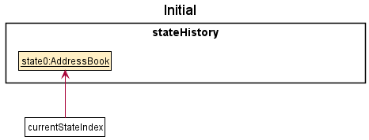

Step 2. The user executes `edit 1 n/Bob` command to edit the first person in the address book. After the `edit` command executes, it calls `Model#saveAddressBookState()`, which saves the modified state of the address book to `stateHistory`, and the `currentStateIndex` is shifted to the newly inserted address book state.

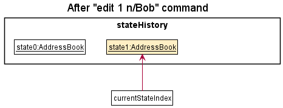

Step 3. The user executes `delete 2` to delete the second person. The `delete` command also calls `Model#saveAddressBookState()`, creating another modified address book state to be saved into the `stateHistory`. As before, `currentStateIndex` is incremented.

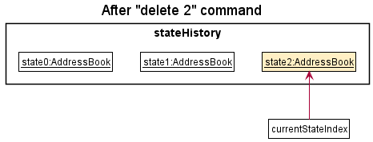

:information_source: **Note:** If a `Command#execute(Model)` fails, it will not call `Model#commitAddressBook()`, so the address book state will not be saved into `stateHistory` and `currentStateIndex` will not change.

Step 4. The user executes `clear` to clear the address book. The `clear` command also calls `Model#saveAddressBookState()`, creating another modified address book state to be saved into the `stateHistory`. Similarly, `currentStateIndex` is incremented.

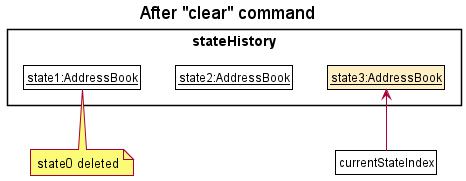

:information_source: **Note:** If `stateHistory#isFull()` is true, i.e. size of `stateHistory` is equal to `UNDO_REDO_CAPACITY` + 1, then the state at index 0 of `stateHistory` will be removed.

Step 5. The user decides that clearing his address book was not a good idea. He executes `undo` to restore his contacts. The `undo` command calls `Model#undoAddressBook()`, which will decrement the `currentStateIndex`, shifting it left once. `currentStateIndex` now points to the previous address book state, and restores the address book to that state.

Step 6. The user wants to revert his `delete 2` command from Step 3 as well. He executes `undo` to revert the deletion. Similar to Step 5, the `undo` command calls `Model#undoAddressBook()`, which will decrement the `currentStateIndex`, shifting it left once. `currentStateIndex` now points to the previous address book state, and restores the address book to that state.

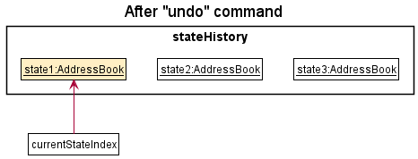

:information_source: **Note:** If the `currentStateIndex` is at index 0, there are no previous address book states to restore. The `undo` command calls `Model#canUndoAddressBook()` to check if it is undoable. In this case, if `undo` is executed once more, an error will be returned to the user rather than performing the undo mechanism.

The following sequence diagram shows how the undo operation works:

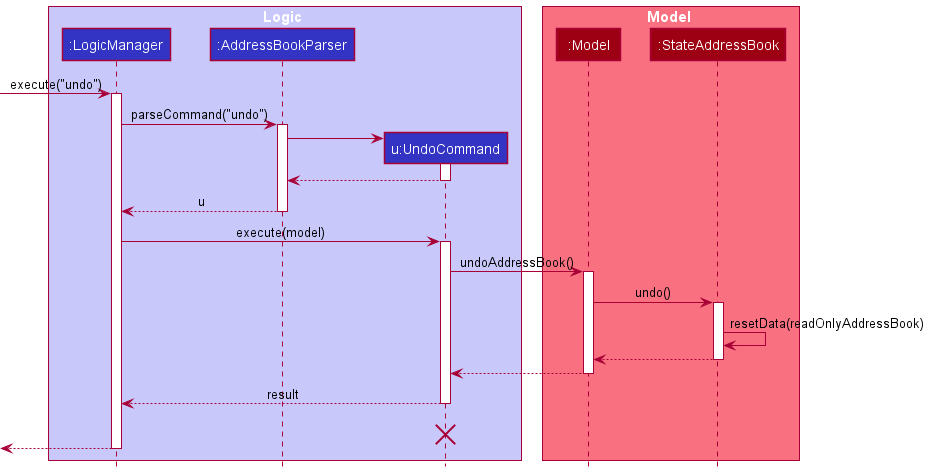

:information_source: **Note:** The lifeline for `UndoCommand` should end at the destroy marker (X) but due to a limitation of PlantUML, the lifeline reaches the end of diagram.

Step 7. The user can't make up his mind and decides to redo his undo. He executes `redo` to revert the previously undid command `delete 2`. The `redo` command calls `Model#redoAddressBook()`, which will increment the `currentStateIndex`, shifting it right once. `currentStateIndex` now points to the address book state that was undone, and restores the address book to that state.

:information_source: **Note:** If `currentStateIndex` is at index `stateHistory.size() - 1`, pointing to the latest address book state, there are no undo command to revert. The `redo` command calls `Model#canRedoAddressBook()` to check if this is the case. If there is nothing to redo, it will return an error to the user rather than performing the redo mechanism.

Step 8. The user executes the `list` command. Commands that do not modify the address book state, such as `list`, will not call `Model#saveAddressBookState()`. Hence, `stateHistory` does not change.

Step 9. The user executes `add n/Tom …​`, which calls `Model#saveAddressBookState()`. Since `currentStateIndex` is not pointing at the end of the `stateHistory`, all address book states after the `currentStateIndex` will be cleared by calling `StateAddressBook#clearAfterCurrentStateIndex()`. Why it is implemented as such is because it no longer makes sense to redo the `clear` command (state3:AddressBook). This behaviour follows modern application undo and redo functionality.

The following activity diagram summarizes what happens when a user executes a new command:

#### 4.1.1. Design considerations:

**Aspect: How undo & redo executes:**

* **Current implementation:** Saves the entire address book.
    * Pros: Easy to implement.
    * Cons: May have performance issues in terms of memory usage.
    * Workaround: Limit the number of undoable and redoable actions, using `UNDO_REDO_CAPACITY`. Currently, it is set to 10.

* **Alternative:** Individual command knows how to undo and redo by itself.
    * Pros: `stateHistory` will use less memory. E.g. for `delete` it only needs to save the person being deleted.
    * Cons: It will take a considerable amount of effort to implement and maintain. Commands that are developed in the future, if applicable, must also support this, which adds to the complexity. It must be done meticulously to ensure that the implementation of each individual command is correct.
    
**Aspect: stateHistory data structure:**

* **Current implementation:** `stateHistory` is an `ArrayList`.
    * Pros: Easy to implement and less prone to bugs.
    * Cons: Inefficiency of removing old states. Since `stateHistory` is an `ArrayList`, when `StateAddressBook#saveState()` is called and `StateAddressBook#isFull()` is true, i.e. `stateHistory.size()` is equal to `UNDO_REDO_CAPACITY` + 1, the first index is removed via `ArrayList.remove(0)`, which has a time complexity of O(n).

* **Alternative 1:** Use a doubly linked list with next and previous pointers. 
    * Pros: O(1) time complexity for all `StateAddressBook` methods.
    * Cons: Java in-built lists do not support next and previous pointers. We will need to carefully implement a doubly linked list and ensure that it is bug free.
* **Alternative 2:** Use a `Deque` to store previous states and a `Stack` to store undid states.
    * Pros: O(1) time complexity for all `StateAddressBook` methods.
    * Cons: It can be tricky to implement the interactions between undo and redo. For example `undo`, followed by `redo`, and then `undo` again. The interaction between undo and redo needs to be managed carefully.

### 4.2. Find feature
The address book find command allow users to search contacts based on their name, email, phone, address, tags, memo and contacted date. When the user keys in a find command, the user input is parsed through a `FindCommandParser` and if a valid input is given, the `FindCommand#execute(Model)` method will be invoked. Doing this will effectively filter the person list in the `Addressbook` and this filtered list will be returned to the Ui for display.

Given below is a sequence diagram to show the execution flow of the find command and a walk-through for each step of the execution:

:information_source: **Note:** The lifeline for `FindCommandParser` should end at the destroy marker (X) but due to a limitation of PlantUML, the lifeline reaches the end of diagram.

 
 

 
 

Step 1. When a user invokes a find command from the Ui, `LogicManager` will be called, which parses the user input into `AddressbookParser#parseCommand(String)`.

Step 2. `FindCommandParser` will then be instantiated and `FindCommandParser#parse(String)` is invoked. If a valid input is provided, `FindCommandParser#createArgMap(String)`is called.

Since a user can key in multiple valid parameters to increase the scope of a search (i.e. search by name and tags), we will need a way to identify different parts of the user input and match the input to their corresponding prefix. This can be achieved with the `ArgumentMultimap` class where it will store the descriptions to search a person by.

Step 3. The `ArgumentMultimap` object is passed as an argument into the  `FindPersonPredicate` constructor and the object created is returned to `FindCommandParser`.

  
:information_source: **Note:** Two note-worthy classes that are created in `FindPersonPredicate` but not shown in the sequence diagram is the `ExactWordMatchPredicate` and `PartialWordMatchPredicate` which encapsulate the logic of conducting exact word match and partial word match on a person's attribute respectively. They are used in the `FindPersonPredicate#test(Person)` method during the filter process and to conduct exact word match/partial word match depending on the person's attribute. More information will be given in the design consideration. 

Step 4. `FindCommandParser` will then use the created `FindPersonPredicate` object to create the `FindCommand` object and this object is returned to `LogicManager`.

Step 5. `LogicManager` will then call `FindCommand#execute(Model)` method and this method will invoke 
`Model#updateFilteredPersonList(Predicate)` where it will update the filter for the person list in the address book.

Step 6. After the filter has been updated, each person in the person list will be tested against the predicate to see if any of the information in the person's attribute matches any of the keywords provided by the user. The filtered list is created and returned to the Ui.

 

#### 4.2.1. Design Considerations:

**Aspect: How the find feature executes:** 
* **Current implementation:** Each invocation of the find command filters the original person list. 
    * Pros: It is easy to implement. 
    * Cons: Users might want to filter the filtered person list even further after viewing it but with the current implementation, this is not possible.  
    * Workaround: To simulate the chaining of multiple find commands, users will have to remember their search condition(s) for the first find and add on/modify the search condition(s) in subsequent find commands. A history feature is developed to assist users to achieve that as it returns the most recent command that is parsed into the application. By invoking the history command (which can be done by pressing the up arrow key), the search condition of the previous find command can be retrieved and all the user have to do is to add on to the returned search condition(s).  
    
* **Alternative 1:** Allow chaining of the find command so that filtering of the filtered person list can be performed.  
    * Pros: It is a useful feature to have. 
    * Cons: It is costly in terms of time and effort to develop as the current implementation can already achieve a similar functionality. To allow chaining of the find command, we will have to change the data structure that stores the filtered person list and since there are multiple classes in the application that relies on this list, changing it might require us to change certain components in other classes as well.

 

**Aspect: Matching criteria of the find command:**
* **Current implementation:** Different search criteria for different search parameters.   
The following table shows the available matching criteria for Abπ and a description to explain the implementation details of the matching criteria:

| Matching criteria                | Description                                                                                                                                                                                                                                                                                                        | 
|----------------------------------|--------------------------------------------------------------------------------------------------------------------------------------------------------------------------------------------------------------------------------------------------------------------------------------------------------------------|
| Partial string matching          | Does a case-insensitive partial match between two strings where it will check if the query string is contained within the compared string. Note that the order of character matters and this includes the whitespace character.                                      |  
| Exact string matching            | Does a case-insensitive exact match between two strings where it will check if the query string is equivalent to the compared string.                                                                                                                                                                              |
| Contacted Date matching criteria | When given a valid positive integer "n", the criteria selects people that had not been contacted for at least n days (relative to the current day). Note that when no positive integer is specified and the user only types in `find c/`, the criteria would select only people who had not been contacted at all. | 

 

Below is a table that shows the matching criteria that is used for each person's attribute and each of the entry is followed with an example:

 

:information_source: **Note:** For all matching criteria, consecutive whitespaces in the query string is treated as a single whitespace. For example, `find n/Alex_ _ _Yeoh` would be treated as `find n/Alex_Yeoh` where "_" represents a single whitespace in the query string.

 

| Attribute      | Prefix | Matching criteria       | Example                                                                                                         | 
|----------------|--------|-------------------------|-----------------------------------------------------------------------------------------------------------------|
| Name           | n/     | Partial string matching | find n/Alex would match with "alexa".                                                                           |  
| Phone Number   | p/     | Partial string matching | find p/9040 would match with "90400204".                                                                        |
| Email          | e/     | Partial string matching | find e/@gmail would match with anybody that has the @gmail domain.                                              | 
| Address        | a/     | Partial string matching | find a/street would match with anybody that has the string "street" in their address.                           |
| Memo           | m/     | Partial string matching | find m/Lover would match with anybody that has the string "lover" in their memo.                                |
| Contacted Date | c/     | Contacted Date Matching | find c/5 would match with anybody that had not been contacted for more than 5 days relative to the current day. |
| Tags           | t/     | Exact string matching   | find t/Family would only match with anybody that has a tag that is equivalent to the string "family".           | 

 :information_source: **Note:** Apart from the `c/` prefix, when multiple of the same prefix is specified in the find command, the search result is equivalent to combining the set of results from the first prefix and the set of results from the second prefix. In other words, the result that is shown from `find n/alex n/yeoh` is semantically the same as telling ABπ to find all person that has the name "alex" or the name "yeoh". For `c/`, only the input arguments from the last `c/` prefix will be parsed into the find command. For example, `find c/ c/10` would only show contacts that had not been contacted for at least 10 days from the current date.        

 :information_source: **Note:** When multiple different prefixes are specified as arguments for the find command, the search result is equivalent to finding all common results between the different results generated from each individual prefix. In other words, `find n/alex p/9020040` is semantically the same as telling ABπ to find all person that has the name "alex" and the phone number "9020040".

 

  * Pros: Allows for a more accurate search that meets the needs of the user (as opposed to adopting a single search criteria for all the person's attribute). 
    * Tags was chosen to follow the exact string match criteria because users are likely to remember the full word of a tag and search for them.
    * For contacted date, a special matching criteria is created specifically for this attribute because the semantics of finding a person by their last contacted date is different from the other attributes. 
    * As for the remaining attributes (name, phone number, email, address and memo), a partial string match criteria was adopted because it allows for more flexibility in the search. 
      * For instance, if a user could only remember a certain part of the string for that specific attribute, this partial matching criteria is able to help the user filter out possible results that he/she might want. 
      * On the other hand, if the user would like to perform a more restrictive search on the address book, he/she can simply type in more characters in the query string.  
    
  * Cons: Edge cases that may cause the search to be ineffective are present and one such test case would be: `find e/gmail` where the intended effect the user might want is to search for all contacts that have the domain name set as "gmail". However, the email "redherringmail@yahoo" will be matched with the user query and this search result does not meet the intended effect the user might want.  
  * Temporary workaround: Instead of searching for "gmail", users are able to search for "@gmail" if they would like to find all contacts that have the domain name set as "gmail".  
  

:information_source: **Note:** A word is defined as consecutive characters that is bounded by whitespaces.
e.g. "This is a sentence!" contains the word "This", "is", "a" and "sentence! 

### 4.3. Memo and ContactedDate person attributes

The address book `Memo` and `ContactedDate` are person attributes, part of `Person`. `Memo` allow users to store miscellaneous information about a `Person`, while `ContactedDate` allow users to keep track of the last contacted date of a `Person`. `Memo` and `ContactedDate` are optional attributes, i.e. either can be empty.
- If `Memo` is empty, it will not be displayed. 
- If `ContactedDate` is empty, it will be displayed as "Not contacted".

All `Person` with empty `Memo` or `ContactedDate` will share the same static final empty instance, `EMPTY_MEMO` or `EMPTY_CONTACTED_DATE` respectively.

A `Person` `Memo` and `ContactDate` can be added during the `add` command or edited via the `edit` command, with the "m/" and "c/" prefix respectively.

Given below is an example usage scenario and how `Memo` can be edited by the `edit` command.

Step 1. The user wants to edit the `Memo` of the first person in the address book and executes `edit 1 m/mute`.

The following sequence diagram shows how the `edit 1 m/mute` operation works:

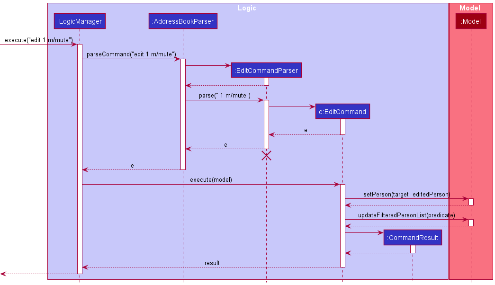

:information_source: **Note:** The lifeline for `EditCommandParser` should end at the destroy marker (X) but due to a limitation of PlantUML, the lifeline reaches the end of diagram.

Editing of `ContactedDate` via the `edit` command works similarly.

`Memo` and `ContactedDate` can also be added during the `add` command. The sequence diagram is similar to the above, with the following differences:
- `AddCommandParser` instead of `EditCommandParser`.
- `AddCommand` instead of `EditCommand`.
- `Model#addPerson(Person)` instead of `Model#setPerson(Person, Person)`.
- `Model#updateFilteredPersonList(Predicate)` will not be called.

#### 4.3.1. Design considerations:

**Aspect: Command to modify `Memo` and `ContactedDate`:**

* **Current implementation:** Modification of `Memo` and `ContactedDate` are integrated into the existing `add` and `edit` command.
    * Pros: Both fields can be optionally added during the `add` command or edited with the `edit` command. This builds upon existing commands, adhering to the DRY principle and the Single Responsibility Principle.
    * Cons: Requires more rigorous testing of `add` and `edit` command as this increases the number of possible arguments that can be parsed by `AddCommandParser` and `EditCommandParser` respectively.

* **Alternative:** Implement individual commands to edit `Memo` and `ContactedDate`.
    * Pros: `Memo` and `ContactedDate` will be separated from the `add` and `edit` command. It can only be added/edited by its respective command.
    * Cons: There will be a lot of code duplication - the new commands to edit `Memo` and `ContactedDate` will be similar to the `edit` command. We feel that this would violate the DRY principle.

**Aspect: `Memo` restrictions:**
* **Current implementation:** The only restriction for `Memo` is the maximum number of characters allowed, 1000 characters.
    * Pros: Memo can take any character, including any special characters, providing flexibility for users. The limit is imposed to protect from and prevent excessively long strings.
    * Cons: There could be special characters which might not display properly, or malicious characters that mess up the display. However, it is the conscious choice of the user to input such characters. We decided to not be overzealous with the input validation. Allowing any character as memo provides great flexibility for users.

**Aspect: `ContactedDate` restrictions:**
* **Current implementation:** Date can be only be empty or a valid dd-mm-yyyy date that is not in the future.
    * Pros: Empty dates can be used by users to represent not contacted. The dd-mm-yyyy format is a common date format in Singapore. Preventing future dates is an intuitive design choice, as it doesn't make sense for last contacted to be in the future.
    * Cons: Dates can only be represented in the dd-mm-yyyy format. This might be a minor inconvenience for a minority of users who could prefer a different date format. Since the dd-mm-yyyy format is most commonly used in Singapore, we will stick with this format.
    
### 4.4. Duplicate detection

Duplicate detection helps users to manage duplicated contacts by preventing duplicated entries. A duplicate is defined as such, a contact is a duplicate if there already exists a contact in Abπ with the same name, phone and email. Duplicate detection is integrated into the `add` and `edit` command, which throws an exception if a contact to be added / edited is a duplicate.

For all person attributes, i.e. `Name`, `Phone`, `Email`, `Address`, `ContactedDate`, `Memo` and `Tag`, they are case-insensitive and extra white spaces between words (2 or more) will be trimmed to a single white space. For example:
- "John Doe" is equal to "john doe" (different capitalization)
- "John &#160;&#160;&#160;&#160;&#160; Doe" is equal to "John Doe" (extra white spaces between words)

For all person attributes except `Phone`, after extra white spaces have been trimmed, a difference in white space is considered as different. For example:
- "John Doe" is different from "JohnDoe" (difference in white space)

For phone, even if there is a difference in white space, it is still considered to be equal. However, a difference in '+' is considered as different. For example:
- "+65 98765432" is equal to "+6598765432" (difference in white space)
- "+65 98765432" is different from "65 98765432" (difference in '+')

#### 4.4.1. Design considerations:

**Aspect: Duplicate person:**

* **Current implementation:** Three attributes of a person (`Name`, `Phone` and `Email`) have to be equal to be considered as a duplicate.
    * Pros: Greater flexibility for users as different individuals may share the same name, or phone, or even email. 
    * Cons: Some might argue that both phone number and email should be unique for all contacts. However, there are many situations where individuals might share the same phone or email, or even both. Restricting such cases would be overzealous input validation. Hence, to be inclusive and flexible, we decided that a person is uniquely identified by the three attributes, `Name`, `Phone` and `Email`.
    
**Aspect: Case sensitivity:**

* **Current implementation:** Case insensitive for all person attributes.
    * Pros: It follows closely to reality, words that only differ in case are often treated as identical. Intuitively, "John Doe" and "john doe" are highly likely to be the same person.
    * Cons: In some rare cases, people might consider "John Doe" and "john doe" to be different individuals. However, this is unlikely and the majority (case-insensitive) approach is favoured.
    
**Aspect: Extra white spaces between words:**

* **Current implementation:** Extra white spaces (2 or more) between words are trimmed to a single white space for all attributes.
    * Pros: Similar to "Aspect: Case sensitivity", it follows closely to reality, person attributes such as name that only differ in extra white spaces between words are often treated as identical. Intuitively, "John &#160;&#160;&#160;&#160;&#160; Doe" and "John Doe" are highly likely to be the same person.
    * Cons: In some rare cases, people might consider "John &#160;&#160;&#160;&#160;&#160; Doe" and "John Doe" to be different individuals. However, this is unlikely. Trimming extra white spaces between words is a quality of life feature, helping users to remove accidental extra white spaces provides a cleaner experience. This behaviour follows modern applications, such as Microsoft Teams.

**Aspect: Difference in white space:**

* **Current implementation:** For all person attributes, except `Phone`, after extra white spaces have been trimmed, a difference in white space is considered as different. 
    * Pros: Again, it follows closely to reality. Except `Phone`, we can agree that "therapist" and "the rapist", a difference in white space, have vastly different meanings. Intuitively, spaces are used as to separate different words, resulting in different meanings when separated.   
     The only exception is `Phone`, the white spaces between phone numbers are only for cosmetic purposes.  
     For example, when dialing "+65 98765432" or "+6598765432", both refers to the same number in reality.
    * Cons: "John Doe" and "JohnDoe", although they look similar, will be considered as different. However, if we allow them to be treated as equal, "therapist" and "the rapist" will also be considered as equal, which is no go. Hence, except for `Phone`, we decided to stick with the normal convention, where a difference in white space is considered as different.

**Aspect: Phone number with '+':**
* **Current implementation:** For `Phone`, a difference in '+' is considered as different.
    * Pros: This implementation follows closely to how phone numbers work in reality. '+' is part of the _[country calling code](https://en.wikipedia.org/wiki/List_of_country_calling_codes)_.  
     For example, dialing "+65 98765432" is different from dialing "65 98765432", both are treated as different numbers in real life.
    * Cons: No significant cons to mention, just that users must ensure that they input the proper phone number with '+' if applicable.

### 4.5. Previous and next feature
Pressing up-arrow key and down-arrow key allows user to navigate among the recent user inputs.
To implement this feature, a "Recorder" class to record the recent user inputs is firstly
needed to be added. Thus, a `CommandList` Class was created to record the recent commands.
Either, typing `previous` or press the up arrow key will invoke `previous command`.
It auto-fills the textbox with the previous command.

* For example, after successfully executed "find n/Alice", "find n/Bob", pressing the up-arrow
key will automatically fill-in the textbox with "find n/Bob", pressing up-arrow key again will
fill-in the textbox with "find n/Alice", and then pressing down-arrow key will
fill-in textbox with "find n/Bob" again.

**Picture explain:** 
**Step 0, no user input yet:**
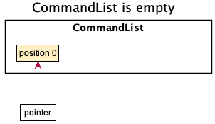
When the CommandList is empty, the pointer will point to position 0.

**Step 1, User executed "find n/Alice":**
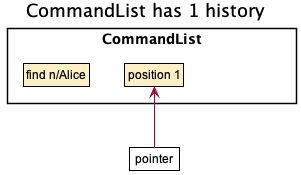
When the CommandList has one history, the pointer will point to position 1,
which is the next position and is empty.

**Step 2, User executed "find n/Bob":**
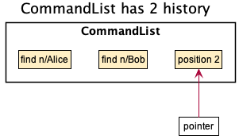
When the CommandList has two history, the pointer will point to position 2,
which is the next position and is empty.

**Step 3, User pressed up-arrow key:**
"find n/Bob" is fetched and auto-filled in textbox

When the user presses up-arrow key, CommandList will decrease the pointer by one.
Now the pointer points to position 1, which is the previous input. Then the information
pointed by pointer will be fetched and auto-filled into the command-box.

**Step 5, User pressed up-arrow key again:**
"find n/Alice" is fetched and auto-filled in textbox
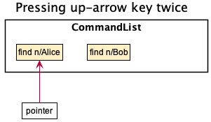
When the user presses up-arrow key again, CommandList will decrease the pointer by one.
Now the pointer points to position 1, which is the previous input. Then the information
pointed by pointer will be fetched and auto-filled into the command-box.

**Step 6, User pressed down-arrow key:**
"find n/Bob" is fetched and auto-filled in textbox
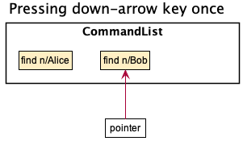
When the user presses down-arrow key, CommandList will increase the pointer by one.
Now the pointer points to position 2, which is the next input. Then the information
pointed by pointer will be fetched and auto-filled into the command-box.

To conclude, when user have not yet press the up-arrow key, the pointer will always point to
the next position of CommandList. So that when user presses the up-arrow key, pointer will decrease
by one to point to the previous position and fetch the history.
When There is no previous/next command available, a CommandException will be thrown
and error message will be shown in the message-box.
  
**Aspect: The execution of PreviousCommand/NextCommand:**

When a `PreviousCommand` or `NextCommand` is being executed, if it is executed successfully,
it will return a special `CommandResult`(with `CommandRemark` set to `HISTORY`) to inform `UI` and ask `UI` to auto-fill the textbox
with the most recent Command. If it is not executed successfully(i.e. there is no previous
or next command available), it will throw `CommandException` and show the error message.

The following activity diagram summarizes what happens when a user executes PreviousCommand/NextCommand:

### 4.6. Detailed Person Display

This section will outline the design choices of implementing the panel to display person details. A class diagram outlining the important classes, methods, and variables is shown below:

`ModelManager` handles adding, changing, and deleting the current `PersonOnDisplay` via listeners. The listener detects changes to the filterable list of contacts stored in the `StateAddressBook` and updates the `PersonOnDisplay` via the methods:

* `ModelManager#updateDisplayUponAddition()` - Updates what the display should contain upon the addition of a `Person`. In the current implementation, it simply updates `PersonOnDisplay` to the newly added `Person`.
* `ModelManager#updateDisplayUponDeletion()` - Updates what the display should contain upon the deletion of a `Person`. In the current implementation, it updates the display to blank if the current `PersonOnDisplay` has been removed from the data.
* `ModelManager#updateDisplayUponModification()` - Updates what the display should contain upon any modifications of attributes of a `Person`. In the current implementation, it updates `PersonOnDisplay` to display the edited data of the edited `Person`.

To link the `PersonOnDisplay` with `DetailedPersonDisplay`, `MainWindow` fetches a `ChangeListener` from `DetailedPersonDisplay` and passes the `ChangeListener` to `ModelManager`. This way, whenever the `PersonOnDisplay` object changes inside `ModelManager`, `DetailedPersonDisplay` will receive an update and modify the display with the updated information accordingly.

#### 4.6.1. Design considerations:

**Aspect: PersonOnDisplay:**

* **Current implementation:** `PersonOnDisplay` is currently located in `ModelManager`
    * Pros: Great flexibility as `ModelManager` already handles additions, modifications, and deletions to the `StateAddressBook`. 
    * Cons: Unable to undo `view` commands or go back to what you were viewing before.
* **Alternative:** Store `PersonOnDisplay` directly inside `AddressBook`
    * Pros: Since `PersonOnDisplay` is now part of the state in an `AddressBook`, `view` commands can now be undone.
    * Cons: Breaks Single Responsibility Principle, as `AddressBook` now contains both the list of contacts and `PersonOnDisplay`.

### 4.7. Backup Feature

To save the user's contacts in Abπ, a user would have to key in any valid command before closing the application. However, when Abπ reads a corrupted data file, the application will show an empty list of contacts upon start up. If this empty list is saved, this would overwrite the previously saved data file, effectively deleting the original contacts the user had in Abπ.   
 
To resolve this issue, a backup method `JsonAddressBookStorage#backupFile(Path, Path)` is implemented where it is triggered whenever Abπ reads a corrupted data file. Essentially, this backup method copies the original data in the "addressbook.json" file and creates a backup file named as "backup_[_DD-MM-YY HH-MM-SS_].json" within the same "data" folder. As a result, this will effectively back up the original data file before any further action is made by the user.
 

_The backup file is located at "[Abπ location]/data/" where [Abπ location] is the location of the "Abpi.jar" application._

#### 4.7.1 Design Considerations:
**Aspect: Limiting the number of backup files:**

* **Current implementation:** Abπ currently allows multiple backups to be made where each backup is uniquely identified by its creation timestamp.
  * Pros: The user's original data file is retained even after multiple attempts in loading a corrupted data file into Abπ.  
  * Cons: There is no hard limit imposed on the number of back up files created. As a result, the size of the data folder might become huge if there is a constant attempt in loading corrupted data files into Abπ and the folder is left unsupervised for a long period of time.
  
* **Alternative 1:** Overwrite the contents of the existing backup file with the new backup data whenever the backup method is invoked. 
  * Pros: This implementation would allow at most one backup file to exist in the data folder, removing the problem of allowing the creation of unlimited backup files.
  * Cons: If there were consecutive attempts in loading the corrupted data file, the user's original data file would be lost.

* **Alternative 2:** Impose a hard limit on the number of backup files created in the data folder.
  * Pros: It would remove the problem of allowing the creation of unlimited backup file. 
  * Cons: Costly in terms of time and effort to implement.

 

[Back to Table of Contents](#table-of-contents)

--------------------------------------------------------------------------------------------------------------------

## 5. Documentation, logging, testing, configuration, dev-ops

* [Documentation guide](Documentation.md)
* [Testing guide](Testing.md)
* [Logging guide](Logging.md)
* [Configuration guide](Configuration.md)
* [DevOps guide](DevOps.md)

[Back to Table of Contents](#table-of-contents)

--------------------------------------------------------------------------------------------------------------------

## 6. Appendix: Requirements

### 6.1. Product scope

**Target user profile**:

* individuals who want an organized address book
* with a need to categorize contacts
* with a need to filter contacts based on attributes
* prefer desktop applications over other types
* fast-typers
* comfortable with command line interface

**Value proposition**: Consolidate information of contacts on a single application and manage them faster than typical mouse/GUI driven app.

### 6.2. User stories

Priorities: High (must have) - `* * *`, Medium (nice to have) - `* *`, Low (unlikely to have) - `*`

| Priority | As a …​  | I want to …​                                              | So that I can…​                                                               |
|----------|----------|-----------------------------------------------------------|-------------------------------------------------------------------------------|
| `* * *`  | new user | see usage instructions                                    | refer to instructions when I forget how to use the App                        |
| `* * *`  | new user | see the app already populated with sample contacts        | see how the app will look when it’s running                                   |
| `* * *`  | user     | add my new contacts                                       | store my contacts in the app                                                  |
| `* * *`  | user     | list all my contacts                                      | see all my contacts in the app                                                |
| `* * *`  | user     | edit a contact                                            | correct mistakes I’ve made when adding in the contacts                        |
| `* * *`  | user     | find my contacts                                          | access my desired contact without having to sieve through my entire phonebook |
| `* * *`  | user     | save my contacts in the phonebook                         | whenever I re-launch the application, my contacts will still be in it         |
| `* * *`  | user     | assign tags to contacts                                   | categorise my contacts                                                        |
| `* * *`  | user     | delete a person                                           | remove contacts that I no longer need                                         |
| `* * *`  | user     | clear all contacts with a single command                  | remove all my contacts without having to manually delete them one at a time   |
| `* * *`  | user     | undo my actions                                           | reverse an accidental command execution                                       |
| `* * *`  | user     | redo my actions                                           | reverse the undo                                                              |
| `* *`    | user     | not have duplicated contacts                              | add and edit contacts without keeping track of duplicates                     |
| `* *`    | user     | invoke my most recently used command                      | access commands that I recently executed                                      |
| `* *`    | user     | have a memo for each contact                              | keep track of miscellaneous information about a person                        |
| `* *`    | user     | keep track of the last contacted date of a person         | identify how long it has been since I last contacted a person                 |

### 6.3. Use cases

(For all use cases below, the **System** is `Abπ` and the **Actor** is `user`, unless specified otherwise)

**Use case: UC01 - Add a person**
 
Guarantees: Adding a contact is successful.
 

**MSS**

1. User requests to add a person and provide details.
2. Abπ adds the person to the list of contacts.
 
Use case ends.

**Extensions**

1a. Abπ detects an error in the input format.
 
&nbsp;&nbsp;&nbsp;&nbsp;1a1. Abπ displays an error message and inform the user of the valid input format.
 
&nbsp;&nbsp;&nbsp;&nbsp;1a2. User enters new input.
 
&nbsp;&nbsp;&nbsp;&nbsp;Steps 1a1 - 1a2 is repeated until the input entered is valid.
 
&nbsp;&nbsp;&nbsp;&nbsp;Use case resumes from step 2.
 
1b. Abπ detects user is attempting to add a contact that already exists.
 
&nbsp;&nbsp;&nbsp;&nbsp;1b1. Abπ displays an error message and inform the user that the contact already exists.
 
&nbsp;&nbsp;&nbsp;&nbsp;1b2. User enters new input.
 
&nbsp;&nbsp;&nbsp;&nbsp;Steps 1b1 - 1b2 is repeated until the input entered is valid.
 
&nbsp;&nbsp;&nbsp;&nbsp;Use case resumes from step 2.

 

**Use case: UC02 - Edit a person**
 
Precondition: There is at least 1 contact in Abπ.
 
Guarantees: Editing a contact is successful.
 

**MSS**

1. User requests to edit an existing contact in the contact list and provide details.
2. Abπ updates the details of the contact.
     
    Use case ends.

**Extensions**

1a. Abπ detects an error in the input format.
 
&nbsp;&nbsp;&nbsp;&nbsp;1a1. Abπ displays an error message and inform the user of the valid input format.
 
&nbsp;&nbsp;&nbsp;&nbsp;1a2. User enters new input.
 
&nbsp;&nbsp;&nbsp;&nbsp;Steps 1a1 - 1a2 is repeated until the input entered is valid.
 
&nbsp;&nbsp;&nbsp;&nbsp;Use case resumes from step 2.
 
1b. Abπ detects an invalid index.
 
&nbsp;&nbsp;&nbsp;&nbsp;1b1. Abπ displays an error message and inform the user of the invalid index.
 
&nbsp;&nbsp;&nbsp;&nbsp;1b2. User enters new input.
 
&nbsp;&nbsp;&nbsp;&nbsp;Steps 1b1 - 1b2 is repeated until the index entered is valid.
 
&nbsp;&nbsp;&nbsp;&nbsp;Use case resumes from step 2.
 
1c. Abπ detects user-specified detail is the same as the contact detail.
 
&nbsp;&nbsp;&nbsp;&nbsp;1c1. Abπ displays an error message and inform the user that there is no change in contact  
&nbsp;&nbsp;&nbsp;&nbsp;&nbsp;&nbsp;&nbsp;&nbsp;&nbsp;&nbsp;&nbsp;&nbsp;information.
 
&nbsp;&nbsp;&nbsp;&nbsp;1c2. User enters new input.
 
&nbsp;&nbsp;&nbsp;&nbsp;Steps 1c1 - 1c2 is repeated until the input entered is valid.
 
&nbsp;&nbsp;&nbsp;&nbsp;Use case resumes from step 2.

 

**Use case: UC03 - Appending tags to a contact**
 
Precondition: There is at least 1 contact in Abπ.
 
Guarantees: Appending tags to a contact is successful.
 

**MSS**

1. User requests to append one or more tags to an existing contact in Abπ and provide details.
2. Abπ updates the tag attribute for the contact by appending the new tags.
    
   Use case ends.

**Extensions**

1a. Abπ detects an error in the input format.
 
&nbsp;&nbsp;&nbsp;&nbsp;1a1. Abπ displays an error message and inform the user of the valid input format.
 
&nbsp;&nbsp;&nbsp;&nbsp;1a2. User enters new input.
 
&nbsp;&nbsp;&nbsp;&nbsp;Steps 1a1 - 1a2 is repeated until the input entered is valid.
 
&nbsp;&nbsp;&nbsp;&nbsp;Use case resumes from step 2.
 
1b. Abπ detects an invalid index.
 
&nbsp;&nbsp;&nbsp;&nbsp;1b1. Abπ displays an error message and inform the user of the invalid index.
 
&nbsp;&nbsp;&nbsp;&nbsp;1b2. User enters new input.
 
&nbsp;&nbsp;&nbsp;&nbsp;Steps 1b1 - 1b2 is repeated until the index entered is valid.
 
1c. Abπ detects that the user is attempting to append a tag that already exists in the contact.
 
&nbsp;&nbsp;&nbsp;&nbsp;1c1. Abπ displays an error message and inform the user of the duplicated tag.
 
&nbsp;&nbsp;&nbsp;&nbsp;1c2. User enters new input.
 
&nbsp;&nbsp;&nbsp;&nbsp;Steps 1c1 - 1c2 is repeated until valid tags are provided by the user.
 
&nbsp;&nbsp;&nbsp;&nbsp;Use case resumes from step 2.

 

**Use case: UC04 - Deleting tags from a contact**
 
Precondition: There is at least 1 contact in Abπ.
 
Guarantees: Deleting tags from a contact is successful.
 

**MSS**

1. User requests to delete one or more existing tags for a contact and provide details.
2. Abπ updates the tag attribute for the contact by deleting the user specified tags.
    
   Use case ends.

**Extensions**

1a. Abπ detects an error in the input format.
 
&nbsp;&nbsp;&nbsp;&nbsp;1a1. Abπ displays an error message and inform the user of the valid input format.
 
&nbsp;&nbsp;&nbsp;&nbsp;1a2. User enters new input.
 
&nbsp;&nbsp;&nbsp;&nbsp;Steps 1a1 - 1a2 is repeated until the input entered is valid.
 
&nbsp;&nbsp;&nbsp;&nbsp;Use case resumes from step 2.
 
1b. Abπ detects an invalid index.
 
&nbsp;&nbsp;&nbsp;&nbsp;1b1. Abπ displays an error message and inform the user of the invalid index.
 
&nbsp;&nbsp;&nbsp;&nbsp;1b2. User enters new input.
 
&nbsp;&nbsp;&nbsp;&nbsp;Steps 1b1 - 1b2 is repeated until the index entered is valid.
 
1c. Abπ detects that the user is attempting to delete a non-existent tag in the contact.
 
&nbsp;&nbsp;&nbsp;&nbsp;1c1. Abπ displays an error message and inform the user that the specified tag does not exist.
 
&nbsp;&nbsp;&nbsp;&nbsp;1c2. User enters new input.
 
&nbsp;&nbsp;&nbsp;&nbsp;Steps 1c1 - 1c2 is repeated until valid tags are provided by the user.
 
&nbsp;&nbsp;&nbsp;&nbsp;Use case resumes from step 2.

 

**Use case: UC04 - Deleting a contact**
 
Precondition: There is at least 1 contact in Abπ.
 
Guarantees: Deleting a contact is successful.
 

**MSS**

1. User requests to delete one contact and provide details.
2. Abπ deletes the contact from the list of contacts.
    
   Use case ends.

**Extensions**

1a. Abπ detects an error in the input format.
 
&nbsp;&nbsp;&nbsp;&nbsp;1a1. Abπ displays an error message and inform the user of the valid input format.
 
&nbsp;&nbsp;&nbsp;&nbsp;1a2. User enters new input.
 
&nbsp;&nbsp;&nbsp;&nbsp;Steps 1a1 - 1a2 is repeated until the input entered is valid.
 
&nbsp;&nbsp;&nbsp;&nbsp;Use case resumes from step 2.
 
1b. Abπ detects an invalid index.
 
&nbsp;&nbsp;&nbsp;&nbsp;1b1. Abπ displays an error message and inform the user of the invalid index.
 
&nbsp;&nbsp;&nbsp;&nbsp;1b2. User enters new input.
 
&nbsp;&nbsp;&nbsp;&nbsp;Steps 1b1 - 1b2 is repeated until the index entered is valid.
 
&nbsp;&nbsp;&nbsp;&nbsp;Use case resumes from step 2.

 

**Use case: UC05 - Deleting multiple contacts**
 
Guarantees: Deleting multiple contacts is successful.
 

**MSS**

1. User requests to delete multiple contacts and provide details.
2. Abπ deletes the contacts from the list of contacts.
    
   Use case ends.

**Extensions**

1a. Abπ detects an error in the input format.
 
&nbsp;&nbsp;&nbsp;&nbsp;1a1. Abπ displays an error message and inform the user of the valid input format.
 
&nbsp;&nbsp;&nbsp;&nbsp;1a2. User enters new input.
 
&nbsp;&nbsp;&nbsp;&nbsp;Steps 1a1 - 1a2 is repeated until the input entered is valid.
 
&nbsp;&nbsp;&nbsp;&nbsp;Use case resumes from step 2.

 

**Use case: UC06 - Clearing all contacts**
 
Guarantees: Removing all contacts is successful.
 

**MSS**

1. User requests to clear all contacts.
2. Abπ removes all contacts from the list of contacts.
    
   Use case ends.

**Extensions**

1a. Abπ detects an error in the input format.
 
&nbsp;&nbsp;&nbsp;&nbsp;1a1. Abπ displays an error message and inform the user of the valid input format.
 
&nbsp;&nbsp;&nbsp;&nbsp;1a2. User enters new input.
 
&nbsp;&nbsp;&nbsp;&nbsp;Steps 1a1 - 1a2 is repeated until the input entered is valid.
 
&nbsp;&nbsp;&nbsp;&nbsp;Use case resumes from step 2.

 

**Use case: UC07 - View contact details**

Precondition: There is at least 1 contact in Abπ.
 
Guarantees: Viewing contact details is successful.
 

**MSS**

1. User requests to view details of a contact.
2. Abπ shows the details of a contact.
    
   Use case ends.

**Extensions**

1a. Abπ detects an error in the input format.
 
&nbsp;&nbsp;&nbsp;&nbsp;1a1. Abπ displays an error message and inform the user of the valid input format.
 
&nbsp;&nbsp;&nbsp;&nbsp;1a2. User enters new input.
 
&nbsp;&nbsp;&nbsp;&nbsp;Steps 1a1 - 1a2 is repeated until the input entered is valid.
 
&nbsp;&nbsp;&nbsp;&nbsp;Use case resumes from step 2.
 
1b. Abπ detects an invalid index.
 
&nbsp;&nbsp;&nbsp;&nbsp;1b1. Abπ displays an error message and inform the user of the invalid index.
 
&nbsp;&nbsp;&nbsp;&nbsp;1b2. User enters new input.
 
&nbsp;&nbsp;&nbsp;&nbsp;Steps 1b1 - 1b2 is repeated until the index entered is valid.
 
&nbsp;&nbsp;&nbsp;&nbsp;Use case resumes from step 2.

 

**Use case: UC08 - Find contacts**

Guarantees: Finding of contacts is successful.
 

**MSS**

1. User requests to find contacts and provide details.
2. Abπ finds the contacts from the list of contacts.
    
   Use case ends.

**Extensions**

1a. Abπ detects an error in the input format.
 
&nbsp;&nbsp;&nbsp;&nbsp;1a1. Abπ displays an error message and inform the user of the valid input format.
 
&nbsp;&nbsp;&nbsp;&nbsp;1a2. User enters new input.
 
&nbsp;&nbsp;&nbsp;&nbsp;Steps 1a1 - 1a2 is repeated until the input entered is valid.
 
&nbsp;&nbsp;&nbsp;&nbsp;Use case resumes from step 2.

 

**Use case: UC09 - List all contacts**

Guarantees: All contacts in Abπ are shown.
 

**MSS**

1. User requests to list all contacts in Abπ.
2. Abπ shows all contacts.
    
   Use case ends.

**Extensions**

1a. Abπ detects an error in the input format.
 
&nbsp;&nbsp;&nbsp;&nbsp;1a1. Abπ displays an error message and inform the user of the valid input format.
 
&nbsp;&nbsp;&nbsp;&nbsp;1a2. User enters new input.
 
&nbsp;&nbsp;&nbsp;&nbsp;Steps 1a1 - 1a2 is repeated until the input entered is valid.
 
&nbsp;&nbsp;&nbsp;&nbsp;Use case resumes from step 2.

 

**Use case: UC10 - Copying all emails**

Guarantees: All the emails are copied.
 

**MSS**

1. User requests to copy all emails.
2. Abπ copies all emails to the user's clipboard.
    
   Use case ends.

**Extensions**

1a. Abπ detects an error in the input format.
 
&nbsp;&nbsp;&nbsp;&nbsp;1a1. Abπ displays an error message and inform the user of the valid input format.
 
&nbsp;&nbsp;&nbsp;&nbsp;1a2. User enters new input.
 
&nbsp;&nbsp;&nbsp;&nbsp;Steps 1a1 - 1a2 is repeated until the input entered is valid.
 
&nbsp;&nbsp;&nbsp;&nbsp;Use case resumes from step 2.

 

**Use case: UC11 - Undoing actions made by Abπ**

Precondition: There must be at least 1 action made by Abπ before user requests to undo an action. 
 
Guarantees: Undoing previously made actions by Abπ is successful.
 
**MSS**

1. User requests to undo an action made by Abπ.
2. Abπ undid the action.
    
   Use case ends.

**Extensions**

1a. Abπ detects an error in the input format.
 
&nbsp;&nbsp;&nbsp;&nbsp;1a1. Abπ displays an error message and inform the user of the valid input format.
 
&nbsp;&nbsp;&nbsp;&nbsp;1a2. User enters new input.
 
&nbsp;&nbsp;&nbsp;&nbsp;Steps 1a1 - 1a2 is repeated until the input entered is valid.
 
&nbsp;&nbsp;&nbsp;&nbsp;Use case resumes from step 2.

 

**Use case: UC12 - Redoing actions made by Abπ**

Precondition: There must be at least 1 undid action made by Abπ before user requests to redo.
 
Guarantees: Redoing an undid action is successful.
 
**MSS**

1. User requests to redo an undid action.
2. Abπ redid the action.
    
   Use case ends.

**Extensions**

1a. Abπ detects an error in the input format.
 
&nbsp;&nbsp;&nbsp;&nbsp;1a1. Abπ displays an error message and inform the user of the valid input format.
 
&nbsp;&nbsp;&nbsp;&nbsp;1a2. User enters new input.
 
&nbsp;&nbsp;&nbsp;&nbsp;Steps 1a1 - 1a2 is repeated until the input entered is valid.
 
&nbsp;&nbsp;&nbsp;&nbsp;Use case resumes from step 2.

 

**Use case: UC13 - User is able to retrieve previously executed commands**
 
Precondition: There must be at least 1 executed command before the user requests to retrieve a previously executed command.
 
Guarantees: Retrieving a previously executed command is successful.
 

**MSS**

1. User requests to retrieve a previously executed command.
2. Abπ retrieves the command.
    
   Use case ends.

**Extensions**

1a. Abπ detects an error in the input format.
 
&nbsp;&nbsp;&nbsp;&nbsp;1a1. Abπ displays an error message and inform the user of the valid input format.
 
&nbsp;&nbsp;&nbsp;&nbsp;1a2. User enters new input.
 
&nbsp;&nbsp;&nbsp;&nbsp;Steps 1a1 - 1a2 is repeated until the input entered is valid.
 
&nbsp;&nbsp;&nbsp;&nbsp;Use case resumes from step 2.

 

**Use case: UC14 - Get help**
 
Guarantees: User will get instructions on how to get help.
 

**MSS**

1. User requests help from Abπ.
2. Abπ provides instructions to the user on how to seek help.
    
   Use case ends.

**Extensions**

1a. Abπ detects an error in the input format.
 
&nbsp;&nbsp;&nbsp;&nbsp;1a1. Abπ displays an error message and inform the user of the valid input format.
 
&nbsp;&nbsp;&nbsp;&nbsp;1a2. User enters new input.
 
&nbsp;&nbsp;&nbsp;&nbsp;Steps 1a1 - 1a2 is repeated until the input entered is valid.
 
&nbsp;&nbsp;&nbsp;&nbsp;Use case resumes from step 2.

 

**Use case: UC15 - Exit**
 
Guarantees: User will exit Abπ.
 

**MSS**

1. User requests to exit from Abπ.
2. Abπ closes.
    
   Use case ends.

**Extensions**

1a. Abπ detects an error in the input format.
 
&nbsp;&nbsp;&nbsp;&nbsp;1a1. Abπ displays an error message and inform the user of the valid input format.
 
&nbsp;&nbsp;&nbsp;&nbsp;1a2. User enters new input.
 
&nbsp;&nbsp;&nbsp;&nbsp;Steps 1a1 - 1a2 is repeated until the input entered is valid.
 
&nbsp;&nbsp;&nbsp;&nbsp;Use case resumes from step 2.

### 6.4. Non-Functional Requirements

1. Should work on any Mainstream Operating System as long as it has Java 11 or above installed.
2. Should be for a single user i.e. (not a multi-user product).
3. Should be able to hold up to 1000 contacts without a noticeable sluggishness in performance for typical usage.
4. Should respond to a command within 2 seconds.
5. Should work without requiring an installer.
6. Should work well (i.e., should not cause any resolution-related inconveniences to the user) for standard screen resolutions 1920x1080 and higher, and screen scales 100% and 125%.
7. The data should be stored locally and should be in a human editable text file.
8. A user with above average typing speed for regular English text (i.e. not code, not system admin commands) should be able to accomplish most of the tasks faster using commands than using the mouse.

### 6.5. Glossary

* **Abπ**: AddressBook pi
* **CLI**: Command-Line Interface
* **DRY**: Don't repeat yourself
* **GUI**: Graphical User Interface
* **JSON**: JavaScript Object Notation
* **MSS**: Main Success Scenario
* **Mainstream Operating System**: Windows, Linux, Unix, OS-X
* **OOP**: Object-oriented programming

[Back to Table of Contents](#table-of-contents)

--------------------------------------------------------------------------------------------------------------------

## 7. Appendix: Instructions for manual testing

Given below are instructions to test the app manually.

:information_source: **Note:** These instructions only provide a starting point for testers to work on;
testers are expected to do more *exploratory* testing.

### 7.1. Launch and shutdown

1. Initial launch

    1. Download the [jar](https://github.com/AY2122S2-CS2103T-T17-4/tp/releases) file and copy into an empty folder.

    2. Open a shell console, such as command prompt or terminal, and navigate to the folder in step 1.
   
    3. Run “Abpi.jar” with the "java -jar" command in the shell console to start the app, e.g. java -jar Abpi.jar  
       Expected: Shows the GUI with a set of sample contacts. The window size may not be optimum.

2. Saving window preferences

    1. Resize the window to an optimum size. Move the window to a different location. Close the window.

    2. Re-launch the app.  
       Expected: The most recent window size and location is retained.

### 7.2. Adding a contact

1. Adding a contact

    1. Prerequisites: A contact with the same name, phone and email must not already exist in the app, otherwise it will be considered as a duplicate.

    2. Test case: `add n/Mark Tay p/91238492 e/marktay@example.com a/markbuilding`  
       Expected: A contact with the name "Mark Tay", phone "91238492", email "marktay@example.com", address "markbuilding", is added. Details of the added contact are shown in the status message and the detailed person display.

    3. Test case: `add n/James Ho p/22224444 e/jamesho@example.com a/123, Clementi Rd, 1234665 c/01-01-2020 m/Avid hiker t/friend t/colleague`  
       Expected: A contact with the name "James Ho", phone "22224444", email "jamesho@example.com", address "123, Clementi Rd, 1234665", contacted date "01-01-2020", memo "Avid hiker", tags "friend" "colleague", is added. Details of the added contact are shown in the status message and the detailed person display. 

    4. Other incorrect add commands to try: `add`, `add hello`, `add p/123 e/123@example.com a/123` (missing name)  
       Expected: Invalid command message displaying the format for proper command usage. The text in the command box will also turn red.

    5. Note:
       - Name, phone, email and address are compulsory attributes that must be specified when using the add command.
       - If a contact with the same name, phone and email already exist, a duplicate error message will be shown.
       - Refer to [4.4. Duplicate detection](#44-duplicate-detection) for specific details about duplicate detection.

### 7.3. Editing a contact

1. Editing a contact's attributes while all contacts are being shown

    1. Prerequisites: List all contacts using the `list` command. Multiple contacts in the list.

    2. Test case: `edit 1 n/Bob`  
       Expected: First contact's name is edited to "Bob". Details of the edited contact are shown in the status message and the detailed person display.

    3. Test case: `edit 1 p/98765432`  
       Expected: First contact's phone is edited to "98765432". Details of the edited contact are shown in the status message and the detailed person display.

    4. Test case: `edit 1 e/example@example.com`  
       Expected: First contact's email is edited to "example@example.com". Details of the edited contact are shown in the status message and the detailed person display.

    5. Test case: `edit 1 a/123 street`  
       Expected: First contact's address is edited to "123 street". Details of the edited contact are shown in the status message and the detailed person display.

    6. Test case: `edit 1 c/`  
       Expected: First contact's contacted date is edited to "Not contacted". Details of the edited contact are shown in the status message and the detailed person display.

    7. Test case: `edit 1 c/01-01-2020`  
       Expected: First contact's contacted date is edited to "Last contacted on 01-01-2020". Details of the edited contact are shown in the status message and the detailed person display.

    8. Test case: `edit 1 m/` 
       Expected: First contact's memo is cleared. Details of the edited contact are shown in the status message and the detailed person display.

    9. Test case: `edit 1 m/Avid hiker` 
       Expected: First contact's memo is edited to "Avid hiker". Details of the edited contact are shown in the status message and the detailed person display.

    10. Test case: `edit 1 t/` 
        Expected: First contact's tags are cleared. Details of the edited contact are shown in the status message and the detailed person display.

    11. Test case: `edit 1 t/friend t/colleague` 
        Expected: First contact's tags are edited to "friend" and "colleague". Details of the edited contact are shown in the status message and the detailed person display.

    12. Other incorrect edit commands to try: `edit`, `edit 1 bob`, `edit x m/Avid hiker` (where x is an integer smaller than 1 or larger than 2147483647)  
        Expected: Invalid command message displaying the format for proper command usage. The text in the command box will also turn red.

    13. Other incorrect edit commands to try: `edit x m/Avid hiker` (where x is an integer larger than the list size and smaller than 2147483648)  
        Expected: Message displaying that the contact index provided does not exist. The text in the command box will also turn red.

    14. Other incorrect edit commands to try: `edit 1`  
        Expected: Message displaying that at least one field to edit must be provided. The text in the command box will also turn red.

    15. Note:
        - Multiple attributes can be edited at once by specifying the respective prefix.
        - If a contact with the same name, phone and email already exist, a duplicate error message will be shown.
        - If the edit does not change anything, a nothing will change error message will be shown.
        - Refer to [4.4. Duplicate detection](#44-duplicate-detection) for specific details about duplicate detection.

### 7.4. Adding tags to a contact

1. Adding tags to a contact while all contacts are being shown
   
    1. Prerequisites: List all contacts using the `list` command. Multiple contacts in the list. Tags to be added must not already exist in the specified contact, otherwise it will be considered as a duplicate.
    
    2. Test case: `addtag 1 t/family`  
       Expected: First contact's tags are appended with "family". Details of the appended tag are shown in the status message and the detailed person display.

    3. Test case: `addtag 1 t/colleague t/pal`  
       Expected: First contact's tags are appended with "colleague" and "pal". Details of the appended tags are shown in the status message and the detailed person display.

    4. Other incorrect addtag commands to try: `addtag`, `addtag hello`, `addtag x t/friends` (where x is an integer smaller than 1 or larger than 2147483647)  
       Expected: Invalid command message displaying the format for proper command usage. The text in the command box will also turn red.

    5. Other incorrect addtag commands to try: `addtag x t/friends` (where x is an integer larger than the list size and smaller than 2147483648)  
       Expected: Message displaying that the contact index provided does not exist. The text in the command box will also turn red.

    6. Other incorrect addtag commands to try: `addtag 1`  
           Expected: Message displaying that at least one t/ must be provided. The text in the command box will also turn red.

    7. Note:
       - If any of the tags to be added already exist in the specified contact, a tag already present error message will be shown.
       - Refer to [4.4. Duplicate detection](#44-duplicate-detection) for specific details about duplicate detection.

### 7.5. Deleting tags of a contact

1. Deleting tags of a contact while all contacts are being shown

    1. Prerequisites: List all contacts using the `list` command. Multiple contacts in the list. Tags to be deleted must exist in the specified contact.

    2. Test case: `deletetag 1 t/friends`  
       Expected: First contact's tag "friends" is deleted. Details of the deleted tag are shown in the status message and the detailed person display.

    3. Test case: `deletetag 2 t/colleagues t/friends`  
       Expected: Second contact's tags "colleagues" and "friends" are deleted. Details of the deleted tags are shown in the status message and the detailed person display.

    4. Other incorrect deletetag commands to try: `deletetag`, `deletetag hello`, `deletetag x t/friends` (where x is an integer smaller than 1 or larger than 2147483647)  
       Expected: Invalid command message displaying the format for proper command usage. The text in the command box will also turn red.

    5. Other incorrect deletetag commands to try: `deletetag x t/friends` (where x is an integer larger than the list size and smaller than 2147483648)  
       Expected: Message displaying that the contact index provided does not exist. The text in the command box will also turn red.

    6. Other incorrect deletetag commands to try: `deletetag 1`  
       Expected: Message displaying that at least one t/ must be provided. The text in the command box will also turn red.

    7. Note:
        - If any of the tags to be deleted does not exist in the specified contact, a tag does not exist error message will be shown.
        - Refer to [4.4. Duplicate detection](#44-duplicate-detection) for specific details about duplicate detection.

### 7.6. Deleting a contact

1. Deleting a contact while all contacts are being shown

    1. Prerequisites: List all contacts using the `list` command. Multiple contacts in the list.

    2. Test case: `delete 1`  
       Expected: First contact is deleted from the list. Details of the deleted contact are shown in the status message.

    3. Other incorrect delete commands to try: `delete`, `delete x` (where x is an integer smaller than 1 or larger than 2147483647)  
       Expected: Invalid command message displaying the format for proper command usage. The text in the command box will also turn red.

    4. Other incorrect delete commands to try: `delete x` (where x is an integer larger than the list size and smaller than 2147483648)  
      Expected: Message displaying that the contact index provided does not exist. The text in the command box will also turn red. 

### 7.7. Finding contacts by their attributes

1. Finding a contact while all contacts are being shown

    1. Prerequisites: List all contacts using the `list` command. Multiple contacts in the list.

    2. Test case: `find n/alex`  
       Expected: The list will be filtered to show only contacts with name containing "john". The number of contacts listed will be shown in the status message.
   
    3. Test case: `find p/2021`  
       Expected: The list will be filtered to show only contacts with phone containing "2021". The number of contacts listed will be shown in the status message.

    4. Test case: `find e/@example`  
       Expected: The list will be filtered to show only contacts with email containing "@example". The number of contacts listed will be shown in the status message.

    5. Test case: `find a/geylang`  
       Expected: The list will be filtered to show only contacts with address containing "geylang". The number of contacts listed will be shown in the status message.

    6. Test case: `find m/`  
       Expected: The list will be filtered to show only contacts that do not have a memo. The number of contacts listed will be shown in the status message.

    7. Test case: `find m/climber`  
       Expected: The list will be filtered to show only contacts with memo containing "climber". The number of 
a       contacts listed will be shown in the status message.

    8. Test case: `find c/`  
       Expected: The list will be filtered to show only contacts that have not been contacted at all. The number of contacts listed will be shown in the status message.
   
    9. Test case: `find c/5`  
       Expected: The list will be filtered to show only contacts that have not been contacted for more than 5 days. The number of contacts listed will be shown in the status message.

    10. Test case: `find t/friends`  
         Expected: The list will be filtered to show only contacts with a tag that exactly matches "friends". The number of contacts listed will be shown in the status message.

    11. Other incorrect find commands to try: `find`  
        Expected: Invalid command message displaying the format for proper command usage. The text in the command box will also turn red.

    12. Other incorrect delete commands to try: `find bob`  
        Expected: Message displaying that at least one valid prefix must be provided. The text in the command box will also turn red.
   
    13. Note:
        - Refer to [4.2. Find feature](#42-find-feature) for specific details about the `find` command.

### 7.8. Saving data

1. Dealing with corrupted data files

   1. Prerequisites: There must be an "addressbook.json" data file in the "[Abπ location]/data/" folder
   2. Remove a line from "addressbook.json" to corrupt it. 
   3. Launch "Abpi.jar". 
   4. Execute `add n/bob p/123 e/123@example.com a/123 street`.
   5. Close the app.  
      Expected: When the corrupted data file is read, an empty addressbook will be loaded. After the command `add n/bob p/123 e/123@example.com a/123 street` is executed, the current list overwrites the existing data file. When the app is closed, a backup copy of the previous data file will be created, named as "backup_[DD-MM-YY HH-MM-SS].json" in the same folder.
   6. Note:
      - Refer to [4.7. Backup Feature](#47-backup-feature) for specific details about the backup data file.

[Back to Table of Contents](#table-of-contents)
