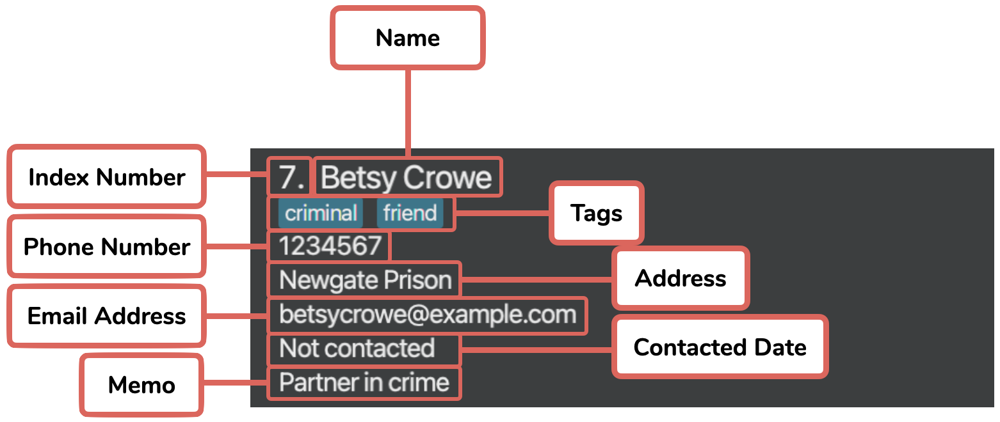
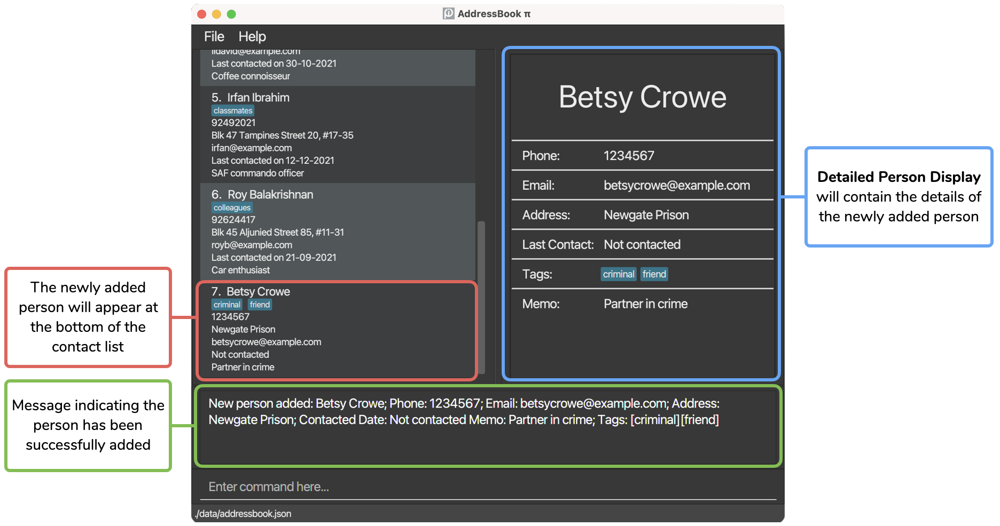
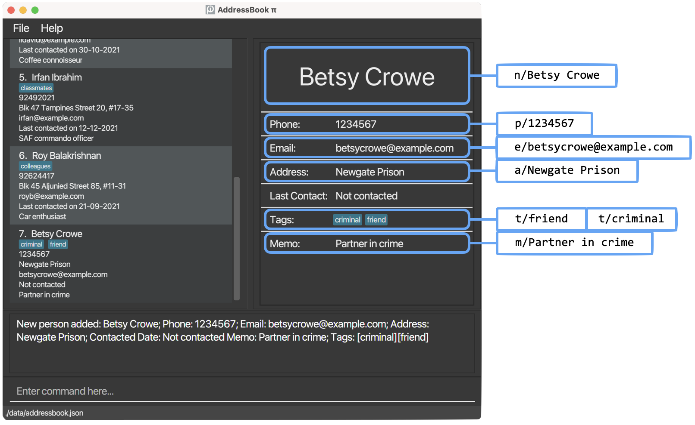
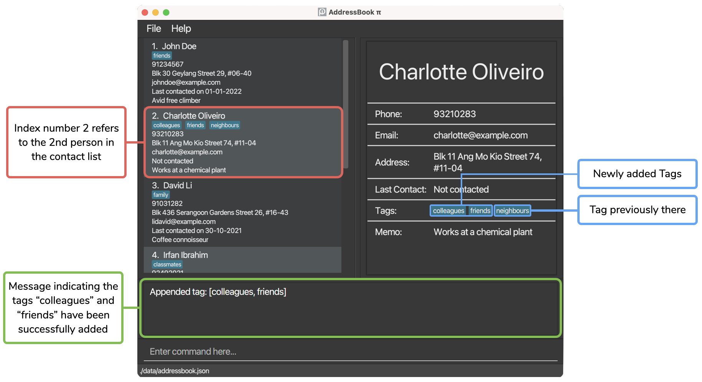
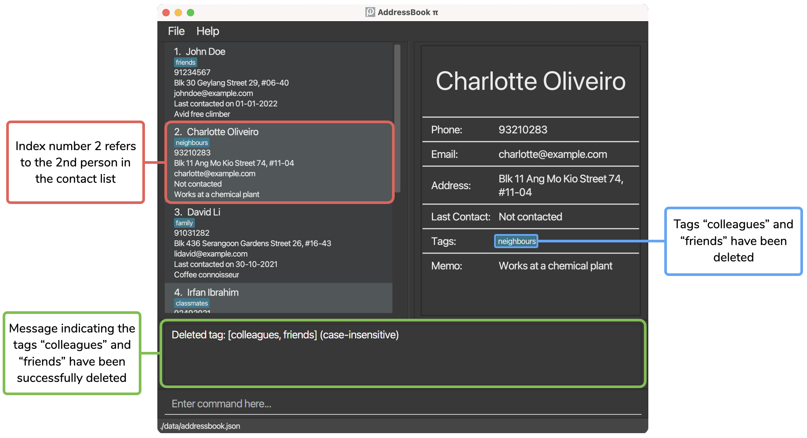
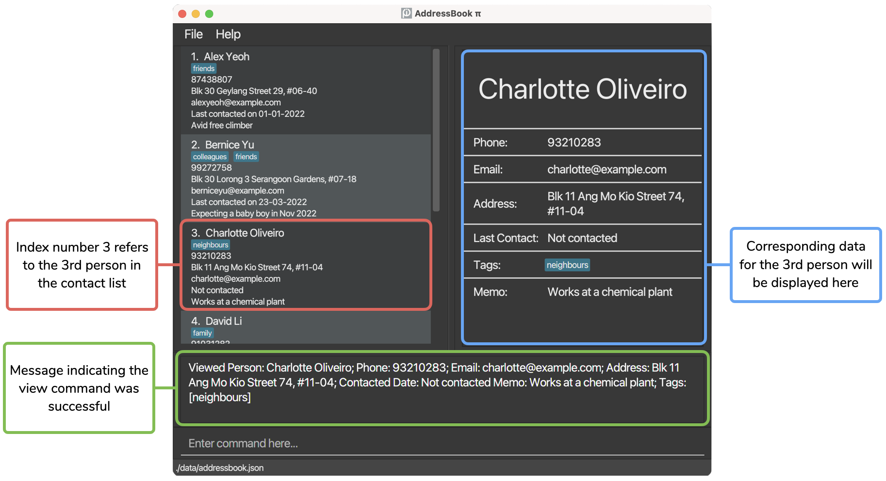

## Overview
AddressBook pi (**Abπ**) is a **360° all-rounded desktop app for managing contacts**, optimized for use via a Command Line Interface (CLI). Abπ is catered towards fast-typers and individuals who want an organized address book with key features including efficient filtering of contacts based on various attributes (name, email, tags, etc.), copying of all emails in the address book and a memo section that allows you to note down notable details about a person. Whether you are an insurance agent who needs to manage numerous client contacts, or a student leader who needs to contact a large number of students, Abπ has got you covered. So what are you waiting for? Download and try out Abπ today!

---

## Table of Contents

[1. Introduction](#1-introduction)  
&nbsp;&nbsp;[1.1. Conventions](#11-conventions)  
[2. Quick Start](#2-quick-start)  
&nbsp;&nbsp;[2.1. Installation](#21-installation)  
&nbsp;&nbsp;[2.2. System Requirements](#22-system-requirements)  
[3. About](#3-about)  
[4. Features](#4-features)  
&nbsp;&nbsp;[4.1. Adding and Editing a person](#41-adding-and-editing-a-person)  
&nbsp;&nbsp;&nbsp;&nbsp;[4.1.1. Adding a person](#411-adding-a-person-add)  
&nbsp;&nbsp;&nbsp;&nbsp;[4.1.2. Editing a person](#412-editing-a-person-edit)  
&nbsp;&nbsp;[4.2. Adding and Editing a person's tag](#42-adding-and-editing-a-persons-tag)  
&nbsp;&nbsp;&nbsp;&nbsp;[4.2.1. Adding tags to a person](#421-adding-tags-to-a-person-addtag)  
&nbsp;&nbsp;&nbsp;&nbsp;[4.2.2. Deleting tags of a person](#422-deleting-tags-of-a-person-deletetag)  
&nbsp;&nbsp;[4.3. Removing persons](#43-removing-persons)  
&nbsp;&nbsp;&nbsp;&nbsp;[4.3.1. Deleting a person](#431-deleting-a-person-delete)  
&nbsp;&nbsp;&nbsp;&nbsp;[4.3.2. Scrubbing address book](#432-scrubbing-address-book-scrub)  
&nbsp;&nbsp;&nbsp;&nbsp;[4.3.3. Clearing all entries](#433-clearing-all-entries-clear)  
&nbsp;&nbsp;[4.4. Displaying person details](#44-displaying-person-details)  
&nbsp;&nbsp;&nbsp;&nbsp;[4.4.1. Viewing person details](#441-viewing-person-details-view)  
&nbsp;&nbsp;[4.5. Filtering the address book](#45-filtering-the-address-book)  
&nbsp;&nbsp;&nbsp;&nbsp;[4.5.1. Finding person by their attributes](#451-finding-person-by-their-attributes-find)  
&nbsp;&nbsp;&nbsp;&nbsp;[4.5.2. Listing all persons](#452-listing-all-persons-list)  
&nbsp;&nbsp;[4.6. Getting all emails](#46-getting-all-emails)  
&nbsp;&nbsp;&nbsp;&nbsp;[4.6.1. Copying Emails](#461-copying-emails-copyemails)  
&nbsp;&nbsp;[4.7. Quality of Life](#47-quality-of-life)  
&nbsp;&nbsp;&nbsp;&nbsp;[4.7.1. Undoing commands](#471-undoing-commands-undo)  
&nbsp;&nbsp;&nbsp;&nbsp;[4.7.2. Redoing commands](#472-redoing-commands-redo)  
&nbsp;&nbsp;&nbsp;&nbsp;[4.7.3. Retrieving recent commands](#473-retrieving-recent-commands-up_arrow_key-or-down_arrow_key)  
&nbsp;&nbsp;[4.8. Miscellaneous](#48-miscellaneous)  
&nbsp;&nbsp;&nbsp;&nbsp;[4.8.1. Viewing help](#481-viewing-help-help)  
&nbsp;&nbsp;&nbsp;&nbsp;[4.8.2. Exiting the program](#482-exiting-the-program-exit)  
&nbsp;&nbsp;[4.9. Policy on duplicates](#49-policy-on-duplicates)  
&nbsp;&nbsp;&nbsp;&nbsp;[4.9.1. Ignoring case difference](#491-ignoring-case-difference)  
&nbsp;&nbsp;&nbsp;&nbsp;[4.9.2. Trimming of extra white spaces](#492-trimming-of-extra-white-spaces)  
&nbsp;&nbsp;&nbsp;&nbsp;[4.9.3. Preventing duplicate contacts](#493-preventing-duplicate-contacts)  
&nbsp;&nbsp;[4.10. Extra information regarding the features](#410-extra-information-regarding-the-features)  
&nbsp;&nbsp;&nbsp;&nbsp;[4.10.1. Saving the data](#4101-saving-the-data)  
&nbsp;&nbsp;&nbsp;&nbsp;[4.10.2. Editing the data file](#4102-editing-the-data-file)  
&nbsp;&nbsp;&nbsp;&nbsp;[4.10.3. Backing up the data file](#4103-backing-up-the-data-file)  
&nbsp;&nbsp;&nbsp;&nbsp;[4.10.4. Predictive viewing](#4104-predictive-viewing)  
[5. FAQ](#5-faq)  
[6. Command Summary](#6-command-summary)  

----

## 1. Introduction
This document is the user guide for AddressBook Level 3.14 (Abπ), an all-rounded desktop app for managing contacts. It is primarily targeted towards fast-typers and individuals who prefer working on a Command-Line Interface (CLI).   

*If you're unfamiliar with Command-Line Interfaces (CLIs), you can find out more about them [here](https://en.wikipedia.org/wiki/Command-line_interface)!*

For users who are interested in using Abπ, this guide is for you as it will help you find out about the different features Abπ offers and the different commands that are available for you to use it.  

**Before we begin, let us understand the different technical terminologies that will be used in this user guide.**

 Word | What it means                                                                                                                                                                                            |
------|----------------------------------------------------------------------------------------------------------------------------------------------------------------------------------------------------------|
Command box| Text box in the Abπ that allows user to type in texts.                                                                                                                                                   |
Command| A sentence that causes Abπ to do something when typed into the command box.                                                                                                                              |
Command word | The first word of every command.                                                                                                                                                                         |
Parameters | Information that is supplied by the user.                                                                                                                                                                |
Execute | The process by which Abπ reads the instructions written by user and acts on it.                                                                                                                          |
String | A programming terminology that describes an ordered sequence of characters.                                                                                                                              | 
Prefix | Part of the user input that allows the user to specify certain attributes of a person.   Type of prefix:  `n/`, `p/`, `a/`, `e/`, `m/`, `c/` and `t/`.                                               
Prefix argument  | The input specified by the user after the prefix in the command box.                                                                                                                                     
Attribute constraints | Constraints that was set by Abπ that specifies how the format of the prefix argument should look like. For eg., Name should not be blank, and its length should be between 1 and 800 (including spaces). | 

### 1.1. Conventions
When this document is read, certain words or sentences are represented in different fonts, typefaces, sizes and weights. This highlighting is systematic where different words will be represented in the same style to indicate their inclusion in a specific category. Below is a table that shows what those categories are and how they are represented by each format/symbol.

Symbol | What it means |
-----|----------------|
`add` | Words/sentences that have this format of display are texts/keyboard commands that can cause a response in Abπ
*Italics* | Sentences that are in italics represent additional information.
:exclamation: | Warning/cautionary statement that should be read. 
:bulb: | Extra tip that may be useful to the reader.
:information_source: | Important information to take note.          
[here](#11-conventions) |Words that are in this format are clickable links that directs you to a certain webpage.

------------

## 2. Quick start
### 2.1. Installation
1. Ensure you have [Java JDK 11](https://www.oracle.com/java/technologies/javase/jdk11-archive-downloads.html) or above installed in your computer.
   
2. Download the latest Abpi.jar from [here](https://github.com/AY2122S2-CS2103T-T17-4/tp/releases).
   
3. Place the file in an empty folder.

4. Open a shell console, such as command prompt or terminal, and navigate to the folder in step 3.

5. Run “Abpi.jar” with the "java -jar" command in the shell console to start the app, e.g. java -jar Abpi.jar

6. Type the command in the command box and press Enter to execute it. e.g. typing **`help`** and pressing Enter on your keyboard will open the help window. 
   Some example commands you can try:

   * `list`: Lists all contacts.

   * `add n/John Doe p/98765432 e/johnd@example.com a/John street, block 123, #01-01` : Adds a contact named `John Doe` to the Address Book.

   * `delete 3` : Deletes the 3rd contact shown in the current list.

   * `clear` : Deletes all contacts.

   * `exit` : Exits the app.

7. Refer to the [features](#4-features) below for details of each command.

### 2.2. System Requirements
Ideally, the machine you are running on should be able to run Java. Below is a list of system specifications that supports Abπ.

_For more information on Java, click [here](https://www.oracle.com/java/technologies/downloads/)_

### Windows
* Windows 10 (8u51 and above)
* Windows 8.x (Desktop)
* Windows 7 SP1
* Windows Vista SP2
* Windows Server 2008 R2 SP1 (64-bit)
* Windows Server 2012 and 2012 R2 (64-bit)
* RAM: 128 MB
* Disk space: 124 MB for JRE; 2 MB for Java Update
* Processor: Minimum Pentium 2 266 MHz processor
 

### Mac OS X
* Intel-based Mac running Mac OS X 10.8.3+, 10.9+
* Administrator privileges for installation

## 3. About

This section will bring you through the Graphical User Interface (GUI) of Abπ.

For each contact in the Contact Display, information is displayed as follows:

:information_source: **Note:** Abπ sorts contacts in chronological order, i.e. contacts added first will be at the top of the contact display, and contacts added last will be at the bottom.

## 4. Features

**:information_source: Notes about the command format:** 

* Words in upper case are the parameters to be supplied by the user. e.g. in `add n/NAME`, `NAME` is a parameter which can be used as `add n/John Doe`.

* Items in square brackets are optional. e.g. `n/NAME [t/TAG]` can be used as `n/John Doe t/friend` or as `n/John Doe`.
 
* Items with `…`​ after them can be used multiple times including zero times. e.g. `[t/TAG]…​` can be used as ` ` (i.e. 0 times), `t/friend`, `t/friend t/family` etc.

* Parameters can be in any order. e.g. if the command specifies `n/NAME p/PHONE_NUMBER`, `p/PHONE_NUMBER n/NAME` is also acceptable.

* Trailing and leading white spaces will be trimmed, i.e. <code>&#160;&#160; delete 1</code> or <code>delete 1 &#160;&#160;</code> will be treated as `delete 1`. 

* If a parameter is expected only once in the command, but you specified it multiple times, only the last occurrence of the parameter will be taken. e.g. if you specify `p/12341234 p/56785678`, only `p/56785678` will be taken.
  
* Commands that do not take in parameters (`help`, `list`, `copyemails`, `undo`, `redo`, `previous`, `next`, `clear`, `exit`) must match the command format exactly, otherwise it will not be recognized. This is to protect from accidental invocations of the wrong command. e.g. if you want to delete the first person and mistakenly call `clear 1` instead of `delete 1`, it will be interpreted as an invalid command to protect you from accidentally clearing the entire address book unintentionally. The proper format to execute clear is just `clear`.

* <a name="index" />Index refers to the index number shown in the contact display. Index must be positive integer between 1 and 2147483647.

* <a name="date" />Dates must be a **valid** [AD](https://en.wikipedia.org/wiki/Anno_Domini) date following the **dd-mm-yyyy** format, and must not be in the future. Examples of valid dates are: "01-01-2020", "31-01-2020".   For both invalid date and incorrect date format, the same error message will be shown.

 

### 4.1. Adding and Editing a person

#### 4.1.1. Adding a person: `add`

Adds a person to the address book.

Format: `add n/NAME p/PHONE_NUMBER e/EMAIL a/ADDRESS [c/CONTACTED DATE] [m/MEMO] [t/TAG]…​`

* Contacted date, memo, and tag are optional.
* If contacted date is specified, it must follow the [specified format](#date).

:bulb: **Tip:**
A person can have any number of tags, including 0.

:information_source: **Note:** Abπ helps to manage duplicates, refer to [4.9. Policy on duplicates](#49-policy-on-duplicates)

Examples:
* `add n/Alice Eng p/98765432 e/aliceeng@example.com a/Alice street`
* `add n/John Doe p/98765432 e/johnd@example.com a/John street, block 123, #01-01 c/01-01-2020 m/Avid hiker`
* `add n/Betsy Crowe t/friend e/betsycrowe@example.com a/Newgate Prison p/1234567 m/Partner in crime t/criminal`

Visual Example:

Upon executing the third example `add n/Betsy Crowe t/friend e/betsycrowe@example.com a/Newgate Prison p/1234567 m/Partner in crime t/criminal`:

Observe how each part of the command specifies the details of Betsy Crowe. Notice that since `c/` (Contacted Date) is missing, the contact has the default Contacted Date of "Not contacted".

[Back to Table of Contents](#table-of-contents)

 

#### 4.1.2. Editing a person: `edit`

Edits an existing person in the address book.

Format: `edit INDEX [n/NAME] [p/PHONE] [e/EMAIL] [a/ADDRESS] [c/CONTACTED DATE] [m/MEMO] [t/TAG]…​`

* Edits the person at the specified `INDEX`. `INDEX` must follow the [specified format](#index).
* At least one of the optional fields must be provided.
* Existing values will be updated to the input values.
* When editing tags, the existing tags of the person will be removed i.e. adding of tags is not cumulative.
* A person’s tags or memo can be removed by typing `t/` or `m/` respectively without specifying text after it.
* A person's contacted date can be edited to "Not contacted" by typing `c/` without specifying a date after it.
* If contacted date is specified, it must follow the [specified format](#date).

:information_source: **Note:** Abπ helps to manage duplicates, refer to [4.9. Policy on duplicates](#49-policy-on-duplicates)

Examples:
* `edit 1 n/John Doe p/91234567 e/johndoe@example.com` edits the name, phone number and email address of the 1st person to be "John Doe", "91234567" and "johndoe@example.com" respectively.
* `edit 2 t/` edits the 2nd person to clear all existing tags.
* `edit 2 t/friends t/colleagues` edits the 2nd person which overwrites all existing tags with the tags "friends" and "colleagues".
* `edit 2 m/Avid hiker` edits the memo of the 2nd person to be `Avid hiker`.
* `edit 2 c/01-01-2020` edits the contacted date of the 2nd person to be "Last contacted on 01-01-2020".
* `edit 2 m/ c/` edits the memo of the 2nd person to be empty and the contacted date to be "Not contacted".

Visual Example:

Upon executing example 1 `edit 1 n/John Doe p/91234567 e/johndoe@example.com`:

[Back to Table of Contents](#table-of-contents)

 

### 4.2. Adding and Editing a person's tag

#### 4.2.1. Adding tags to a person: `addtag`

Appends one or more tags to a specified person in the address book.

Format: `addtag INDEX t/TAG…`

* Appends one or more tags to the person at the specified `INDEX`. `INDEX` must follow the [specified format](#index).
* If any of the tag to be appended already exists in the person's tag list, the command will be rejected.

Examples:
* `addtag 1 t/friends` appends the tag "friends" to the 1st person in the displayed person list.
* `addtag 2 t/colleagues t/friends` appends the tag "colleagues" and "friends" to the 2nd person in the displayed person list.

Visual Example:

Upon executing example 2 `addtag 2 t/colleagues t/friends`:

[Back to Table of Contents](#table-of-contents)

 

#### 4.2.2. Deleting tags of a person: `deletetag`

Deletes one or more tags of a specified person in the address book.

Format: `deletetag INDEX t/TAG…`

* Deletes one or more tags of the person at the specified `INDEX`. `INDEX` must follow the [specified format](#index).
* If any of the tag to be deleted does not exist, the command will be rejected.

:bulb: **Tip:**
To overwrite all existing tags or remove all tags in one go, refer to [4.1.2. Editing a person](#412-editing-a-person-edit).

Examples:
* `deletetag 1 t/friends` deletes the tag "friends" of the 1st person in the displayed list if the tag exists.
* `deletetag 2 t/colleagues t/friends` deletes the tag "colleagues" and "friends" of the 2nd person in the displayed list if both tags exist.

Visual Example:

Continuing from the visual example in [4.2.1. Adding tags to a person](#421-adding-tags-to-a-person-addtag), upon executing `deletetag 2 t/colleagues t/friends`:

[Back to Table of Contents](#table-of-contents)

 

### 4.3. Removing persons

#### 4.3.1. Deleting a person: `delete`

Deletes the specified person from the address book.

Format: `delete INDEX`

* Deletes the person at the specified `INDEX`. `INDEX` must follow the [specified format](#index).

Examples:
* `list` followed by `delete 2` deletes the 2nd person in the address book.
* `find n/Betsy` followed by `delete 1` deletes the 1st person in the results of the `find` command.

[Back to Table of Contents](#table-of-contents)

 

#### 4.3.2. Scrubbing address book: `scrub`

* Similar to [delete](#431-deleting-a-person-delete) as it cleans up the address book of unwanted contacts. 
* Allows multiple person to be deleted by specifying the criteria to delete a person by through the use of prefixes.
* Abπ would use the specified criteria and scan through the person list and delete anybody that matches the criteria.
* Duplicated prefix arguments are treated as the same criteria to delete a person by. Examples of duplicated prefix arguments include `scrub t/family t/family`.

Format: `scrub [p/PHONE] [e/EMAIL DOMAIN] [t/TAG]…​`
* Delete contacts that matches any of the phone number, email domain or tag specified from the command.
* At least one parameter must be present.
* For phone number and tags, an exact match criteria is employed, where `scrub t/family` would only scrub contacts that have the tag "family".
* For email, an exact match criteria is employed for the email domain. Look at the information box below to learn more about what is an email domain.
* Note that for phone numbers, white spaces are ignored. That is, ABπ sees "+65 90400204" and "+6590400204" as equivalent numbers. 
* The matching criteria is case-insensitive.
* Prefix arguments must conform to the attribute constraints.  

:information_source: **Note:** Email domain is defined to be the string that is after the "@" symbol (inclusive). For example, a valid scrub command that removes contacts based on their email domain is: `scrub e/@gmail` or `scrub e/@gmail.com`. Note that `scrub e/tester@gmail.com` would result in an invalid command format error since "e/" only takes in a valid domain name. 

:information_source: **Note:** When multiple of the same prefix is specified in the scrub command, the result is equivalent to deleting the set of results from the first prefix and the set of results from the second prefix. In other words, the result that is shown from `scrub p/90400203 p/90400202` is semantically the same as telling ABπ to delete all person that has the number "90400203" or the number "90400202".

:information_source: **Note:** When different prefixes are specified for the scrub command, the result is equivalent to deleting anybody that matches all the condition specified by the prefix arguments. In other words, `scrub p/90400203 e/@example` is semantically the same as telling ABπ to delete all person that has the number "90400203" and has the email domain "@example".

 

Examples:
* `scrub e/@gmail.com` would scrub contacts that have the "@gmail.com" domain name for their email.
* `scrub e/@gmail` would scrub contacts that have the "@gmail" domain name and this includes "@gmail.com" and "@gmail.sg".
* `scrub p/90200402` would scrub contacts that have the number "90200402".
* `scrub t/family` would scrub contacts that have the tag "family".

Visual Example:

Upon executing the command `scrub t/friends`:

[Back to Table of Contents](#table-of-contents)

 

#### 4.3.3. Clearing all entries: `clear`

Clears all entries from the address book.

Format: `clear`

[Back to Table of Contents](#table-of-contents)

 

### 4.4. Displaying person details

#### 4.4.1. Viewing person details: `view`

Displays the detailed description of the selected person on the right side of the User Interface.

Format: `view INDEX`

* Displays detailed information of person at the specified `INDEX`. `INDEX` must follow the [specified format](#index).

Examples:
* `list` followed by `view 2` displays the 2nd person in the address book.
* `find n/John` followed by `view 1` displays the 1st person in the results of the `find` command.

Visual Example:

Upon executing the command `view 3`:

:information_source: **Note:** Abπ will try to predict which person you're trying to view as you execute other commands. As an example, when you add a new person, Abπ will automatically display the newly added person without the need of a `view` command. For more information on the predictive behavior, check out [4.10.4. Predictive viewing](#4104-predictive-viewing).

[Back to Table of Contents](#table-of-contents)

 

### 4.5. Filtering the address book

#### 4.5.1. Finding person by their attributes: `find`

* Finds persons whose names contain any of the given keywords.
* Duplicated prefix arguments are treated as the same criteria to search a person by. E.g. The result from `find t/family t/family` is the same as the result from `find t/family`. 

Format: `find [n/NAME] [p/PHONE] [e/EMAIL] [a/ADDRESS] [m/MEMO] [c/Days] [t/TAG]…​`

Below is a table that shows the different matching criteria that is present in the app:

| Matching criteria                | Attributes that uses the criteria  | Prefix Argument Constraints                           | Description                                                                                                                                                                                                                                                                                                                               | 
|----------------------------------|------------------------------------|-------------------------------------------------------|-------------------------------------------------------------------------------------------------------------------------------------------------------------------------------------------------------------------------------------------------------------------------------------------------------------------------------------------|
| Partial string matching          | Name, Phone number, Email, Address | Prefix argument must be between 1 to 1000 characters. | Does a case-insensitive partial match between two strings where it will check if the prefix argument partially matches with the compared string. Note that the order of character matters and this includes the whitespace character. For phone numbers, white spaces are ignored. That is, `find p/+65 9040` would match with "+659040". |  
| Exact string matching            | Tags                               | Prefix argument must be between 1 to 1000 characters. | Does a case-insensitive exact match between two strings where it will check if the prefix argument is equivalent to the compared string.                                                                                                                                                                                                  |
| Contacted Date matching criteria | Contacted Date                     | Prefix argument must be between 0 to 1000 characters. | When given a valid positive integer "n", the criteria selects people that had not been contacted for at least n days (relative to the current day). Note that when no positive integer is specified and the user only types in `find c/`, the criteria would select only people who had not been contacted at all.                        |
| Memo matching criteria           | Memo                               | Prefix argument must be between 0 to 1000 characters. | Tests if any of the word in the person's memo partially matches to the user's memo prefix argument. If an empty argument is specified, i.e "m/",the predicate matches with any person that has no memo.                                                                                                                                   |   

Examples:
* `find n/Alex` would match with "alexa".
* `find p/9040` would match with "90400204".
* `find p/+65 9040` would match with "+6590400204".
* `find e/@gmail` would match with anybody that has the "@gmail" domain.
* `find a/street` would match with anybody that has the string "street" in their address.
* `find m/Lover` would match with anybody that has the string "lover" in their memo.
* `find m/` would match with anybody that has no memo.
* `find c/5` would match with anybody that had not been contacted for more than 5 days relative to the current day.
* `find c/` would match with anybody that had not been contacted.
* `find t/Family` would only match with anybody that has a tag that is equivalent to the string "family".
* `find t/colleague t/friends` would match with anybody that has the tag "colleague" or "friends".
* `find t/family e/@example` would only match with anybody that has a tag "family" and an email domain "@example".

 

:information_source: **Note:**
 Apart from the `c/` prefix, when multiple of the same prefix is specified in the find command, the search result is equivalent to combining the set of results from the first prefix and the set of results from the second prefix. In other words, the result that is shown from `find n/alex n/yeoh` is semantically the same as telling ABπ to find all person that has the name "alex" or the name "yeoh".   

 

For the `c/` prefix, only the prefix argument from the last `c/` prefix will be parsed into the find command. For example, `find c/ c/10` would only show contacts that had not been contacted for at least 10 days from the current date.

:bulb: **Tip:**
 When different prefixes are specified for the find command, the search result is equivalent to finding anybody that meets all the criteria specified by the prefix arguments. In other words, `find n/alex p/9020040` is semantically the same as telling ABπ to find all person that has the name "alex" and the phone number "9020040".

[Back to Table of Contents](#table-of-contents)

 

#### 4.5.2. Listing all persons: `list`

Shows a list of all persons in the address book.

Format: `list`

[Back to Table of Contents](#table-of-contents)

 

### 4.6. Getting all emails

#### 4.6.1. Copying Emails: `copyemails`

Copies a semicolon-separated list of all displayed emails to clipboard.

Format: `copyemails`

Examples:
* `list` followed by `copyemails` will copy all emails currently displayed in the list to your clipboard.
* When you paste from clipboard, a semicolon-separated list will appear. (E.g. "johndoe@example.com; betsycrowe@example.com")

[Back to Table of Contents](#table-of-contents)

 

### 4.7. Quality of Life

#### 4.7.1. Undoing commands: `undo`

Undo previous commands that modified data, which includes:   
`add`, `edit`, `delete`, `clear`, `scrub`, `addtag` and `deletetag`.

Format: `undo`

* The maximum number of undo is 10.

:information_source: **Note:** If `undo` is successful, Abπ will display "Undo success!". Currently, it does not display a message on what has been undone. This message will be implemented in a future version.

Examples:
* `undo` after calling `delete 1` restores the address book to its previous state prior to the deletion.
* `undo` after calling `edit 1 n/Bob` restores the address book to its previous state prior to the edit.

[Back to Table of Contents](#table-of-contents)

 

#### 4.7.2. Redoing commands: `redo`

Redo reverses the `undo` command.

Format: `redo`

* The maximum number of redo is 10.

:information_source: **Note:** If `redo` is successful, Abπ will display "Redo success!". Currently, it does not display a message on what has been redone. This message will be implemented in a future version.

Examples:
* `redo` after calling `undo` restores the address book to its previous state prior to undo.

[Back to Table of Contents](#table-of-contents)

 

#### 4.7.3. Retrieving recent commands: `UP_ARROW_KEY` or `DOWN_ARROW_KEY`

By pressing the `UP_ARROW_KEY` button or the `DOWN_ARROW_KEY` button on your keyboard, you can easily retrieve your recent commands and the recent command would autofill into the text box.

Examples:
* If the recent commands are `find n/Anny` `find n/Bob` `find n/Cathy`.
* Pressing `UP_ARROW_KEY` once will fill-in the textbox with "find n/Cathy".
* Then pressing `UP_ARROW_KEY` again will fill-in the textbox with "find n/Bob".
* Then pressing `DOWN_ARROW_KEY` once will fill-in the textbox with "find n/Cathy".

[Back to Table of Contents](#table-of-contents)

 

### 4.8. Miscellaneous

#### 4.8.1. Viewing help: `help`

Shows a message explaining how to access the help page.

Format: `help`

[Back to Table of Contents](#table-of-contents)

 

#### 4.8.2. Exiting the program: `exit`

Exits the program.

Format: `exit`

[Back to Table of Contents](#table-of-contents)

 

### 4.9. Policy on duplicates

#### 4.9.1. Ignoring case difference
Abπ ignores case difference for the person attributes name, email, address, memo and tag to provide a more seamless experience that matches the real world.
* Attributes that only differs in case sensitivity is considered as identical.

Examples:

* "John Doe" and "john doe" is considered as the same name.
* "LIKES TO DRINK" and "likes to drink" is considered as the same tag.

[Back to Table of Contents](#table-of-contents)

 

#### 4.9.2. Trimming of extra white spaces
Abπ helps to remove accidental extra white spaces between words to provide a cleaner experience.

* For name, phone, address, memo, and tag, extra white spaces (2 or more) between words will be replaced with a single white space.  

Examples:
* "John &#160;&#160;&#160;&#160;&#160; Doe" will be trimmed to "John Doe".
* "Likes &#160;&#160;&#160; to &#160;&#160;&#160; drink" will be trimmed to "Likes to drink".

[Back to Table of Contents](#table-of-contents)

 

#### 4.9.3. Preventing duplicate contacts
Abπ helps to manage duplicates by preventing duplicate contacts of identical name, phone and email when using the `add` and `edit` commands.

* Each contact in Abπ is uniquely identified by their name, phone and email, that is, a contact is only considered a duplicate if there already exists a contact in Abπ with the same name, phone and email.
* The reason why duplicate is considered as such is to provide greater flexibility as different individuals may share the same name, or phone, or even email.

:information_source: **Note:**  
For all person attributes except phone, after extra white spaces have been trimmed, a difference in white space is considered as different. For example:  
"John Doe" is different from "JohnDoe" (difference in white space)  
 
For phone, even if there is a difference in white space, it is still considered to be equal. However, a difference in '+' is considered as different. For example:  
"+65 98765432" is equal to "+6598765432" (difference in white space)  
"+65 98765432" is different from "65 98765432 (difference in '+')"

[Back to Table of Contents](#table-of-contents)

 

### 4.10. Extra information regarding the features

#### 4.10.1. Saving the data
Abπ data are saved in the hard disk automatically after any command that changes the data. There is no need to save manually.

[Back to Table of Contents](#table-of-contents)

 

#### 4.10.2. Editing the data file

Abπ data are saved as a JSON file `[JAR file location]/data/addressbook.json`. Advanced users are welcome to update data directly by editing that data file.

:exclamation: **Caution:**
 If your changes to the data file makes its format invalid, AddressBook will discard all data and start with an empty data file at the next run.

[Back to Table of Contents](#table-of-contents)

 

#### 4.10.3. Backing up the data file

* Everytime the original data file is corrupted, Abπ would back up your data and store it in "[_Abπ location_]/data/" as "backup[_DD-MM-YY HH-MM-SS_].json". The backup file format will be similar to the backup file shown in the image below.

* To reload your data from the backup file into Abπ, fix the corrupted entries in the backup file to a proper json format, rename the file as "addressbook.json" and overwrite the existing "addressbook.json" file.
* Backup files are generated when Abπ fails to read the data in the "addressbook.json" file.
* There can be multiple backup files in the folder depending on how many times Abπ fails to read the original data file. 
* Do note that in the current iteration of Abπ, a **limit on the number of backup files has not been implemented**. 

:information_source: **Note:** Theoretically, a user is able to constantly create backup files using Abπ until the folder size becomes unusually huge. To reduce the folder size, users would need to constantly head over to the data folder and delete unused backup files. The team understands and acknowledges that this may prove to be an inconvenience for some users hence, in future iterations of Abπ, the team would impose a limit on the number of backup files for a better user experience.

[Back to Table of Contents](#table-of-contents)

 

#### 4.10.4. Predictive viewing

Abπ will pre-emptively update the display after various commands:

* After an `add` command, the newly added person will be automatically displayed. This allows you to check if all the details of the person you just added are correct without needing to execute an additional `view` command.
* Similarly, when you `redo` an `add` command, the newly added person will be automatically displayed.
* If the details of a person is changed (such as from an `edit` command or via `undo` after an edit command), the display will automatically display the edited person.
* After a deletion command (such as `delete` or `clear`), followed by an `undo` command, the deleted person(s) will be restored and automatically displayed. This allows you to check if the person you just deleted was the correct person without needing to execute an additional `view` command.

In addition, Abπ aims to keep all displayed information updated:

* If the person currently on display is removed from the address book, the display will be blank. 
* If the person currently on display has their details changed, the display will contain the newly updated details.

Hence, there is no need to worry about the display containing outdated information.

[Back to Table of Contents](#table-of-contents)

--------------------------------------------------------------------------------------------------------------------

## 5. FAQ

**How do I save in Abπ?** 
There is no need to save manually. Abπ automatically saves the data after any command that changes the data.

**Where does Abπ store its data?** 
Abπ data is stored in data folder located at Abπ's home directory, the data file name is "addressbook.json". Specifically "[_Abπ location_]/data/addressbook.json".

**How do I transfer my data to another computer?** 
Simply overwrite the "addressbook.json" data file with your previous "addressbook.json" data file.

**What happens if I executed a command unintentionally?** 
Fret not, Abπ supports the `undo` and `redo` commands, which follows modern application undo and redo functionality.

**Why is my data gone?** 
When the data file is corrupted, an empty address book will be shown. Do not worry, Abπ has made a backup of your previous data file, named as "backup[_DD-MM-YY HH-MM-SS_].json", located at "[_Abπ location_]/data/". For more information on how to restore your backup data, take a look [here](#4103-backing-up-the-data-file).

[Back to Table of Contents](#table-of-contents)

--------------------------------------------------------------------------------------------------------------------

## 6. Command summary

Action | Format, Examples
--------|------------------
**Add** | `add n/NAME p/PHONE_NUMBER e/EMAIL a/ADDRESS [c/CONTACTED DATE] [m/MEMO] [t/TAG]…​`   e.g., `add n/James Ho p/22224444 e/jamesho@example.com a/123, Clementi Rd, 1234665 c/01-01-2020 m/Avid hiker t/friend t/colleague`
**Edit** | `edit INDEX [n/NAME] [p/PHONE_NUMBER] [e/EMAIL] [a/ADDRESS] [c/CONTACTED DATE] [m/MEMO] [t/TAG]…​`  e.g.,`edit 2 n/James Lee e/jameslee@example.com`
**AddTag** | `addtag INDEX t/TAG…` e.g.,`addtag 1 t/friends`
**DeleteTag** | `deletetag INDEX t/TAG…` e.g.,`deletetag 1 t/friends`
**Delete** | `delete INDEX`  e.g., `delete 3`
**Scrub** | `scrub [p/PHONE] [e/EMAIL DOMAIN] [t/TAG]…​`   e.g., `scrub e/@gmail.com`
**Clear** | `clear`
**View** | `view INDEX`  e.g., `view 1`
**Find** | `find [n/NAME] [p/PHONE_NUMBER] [e/EMAIL] [a/ADDRESS] [m/MEMO] [t/TAG] [c/Days]…​`   e.g., `find n/James Jake`
**List** | `list`
**CopyEmails**| `copyemails`
**Undo** | `undo`
**Redo** | `redo`
**Recent commands**| Pressing `UP_ARROW_KEY` or `DOWN_ARROW_KEY`
**Help** | `help`
**Exit** | `exit`

[Back to Table of Contents](#table-of-contents)
